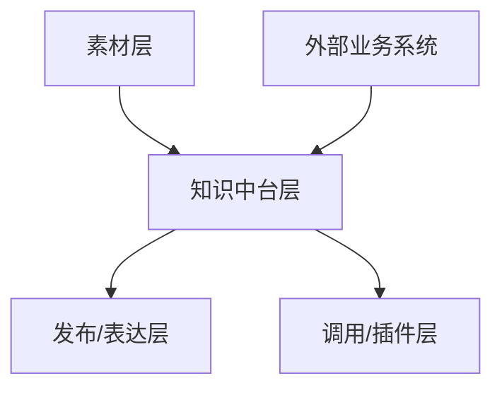

# 15 · 企业知识层与插件化路线设计 — 2026-05-18

## 一、为什么现在要补这份设计

TDL 项目最初从“把任务建起来、提醒起来、回收起来”出发，但当前需求已经明显超出单纯任务管理：

1. 会议材料不能只抽任务，还要先理解经营主题、关键矛盾、前后依赖和管理节奏。
2. 后续会接入薪资、考勤、销售、培训、招聘等系统。
3. 最终目标不是多做几个功能，而是让 AI 能基于企业事实、关系和判断规则，形成可调度的经营能力。

因此，TDL 后续不应只演进成“更聪明的待办工具”，而应逐步长成：

> 以任务为最小执行单元、以知识层为中枢、可被多个经营插件调用的企业经营操作系统雏形。

## 二、已有资产给出的启发

### 1. 励步知识库给出的启发

现有励步资料已经证明，真正可复用的知识底座不能只存文档，而要区分：

1. 素材层
2. 中台层
3. 发布层
4. 调用层

并且中台层不是一个平面，而是至少要拆出：

1. 课程结构
2. 教学动作
3. 评估升阶
4. 发展支持
5. 销售续费支持

更关键的是，励步底座已经明确了两个很重要的设计原则：

- 结构表只保留骨架，判断和过程数据不能全塞进去。
- 销售表达必须服从上游判断，不能绕开评估层自己造结论。

这对 TDL 的直接借鉴是：

- `Task` 不能直接承载所有经营意义。
- “提醒某件事”必须和“为什么做这件事、它服务什么目标、前面依赖什么判断”分层。

### 2. 斯坦星球知识库给出的启发

斯坦星球现有架构强调：

1. 图谱化可连接
2. 程序可消费
3. 概念、能力、关系都要有稳定字段和可治理状态
4. 上游底座和下游成品要分开，不能让展示文案反向污染基础结构

这对 TDL 的直接借鉴是：

- 企业知识层必须优先稳定“事实、实体、关系、事件”的上游结构。
- 后续插件只是调用层，不能每个插件各自造一套孤立知识。
- 任何关系都要可追溯、可校验、可更新，不能只靠模型一次性推理。

## 三、企业知识层的四层结构

### 1. 素材层

保留厚内容和证据，不要求立即统一口径：

- 会议纪要
- 述职材料
- 经营报表
- 薪资记录
- 考勤记录
- 销售过程数据
- 培训资料
- 招聘过程材料
- 各品牌既有知识库

### 2. 知识中台层

把企业经营中最稳定、最值得被程序理解的对象抽出来：

| 类型 | 说明 |
|---|---|
| `Entity` | 人、部门、品牌、校区、课程线、客户群体 |
| `Fact` | 已知事实，如本月招聘人数、某校区续费率 |
| `Relation` | 汇报、协作、依赖、归属、影响 |
| `Event` | 会议、招聘、培训、发薪、促销、异常 |
| `Goal` | 阶段目标、经营目标、组织目标 |
| `Task` | 可执行动作 |
| `Decision` | 已做出的判断或选择 |
| `Risk` | 已识别风险及其触发条件 |
| `Metric` | 可量化指标 |
| `Issue` | 已被提出但尚未解决的待处理议题 |
| `Signal` | 刚显露、尚未形成正式议题的观察线索 |

### 3. 发布/表达层

把同一套知识翻译成不同对象可用的版本：

- 给老板看的经营摘要
- 给管理者看的任务编排
- 给执行者看的动作提示
- 给培训场景看的复盘材料
- 给 AI 的结构化上下文

### 4. 调用/插件层

未来插件从同一知识层取数，而不是各自读一套散文件：

- 企业战略蓝图
- 企业节奏把控
- 任务优化
- 经营策略优化
- 人才与组织诊断
- 培训建议
- 招聘优先级判断

## 四、和现有系统的关系

| 系统 | 进入知识层后主要贡献 |
|---|---|
| TDL 系统 | `Task`、状态、责任、节奏、回收结果 |
| 薪资系统 | 成本、激励结构、岗位负荷、周期节点 |
| 考勤系统 | 出勤、稳定性、纪律、负荷迹象 |
| 销售业务系统 | 线索、转化、收入、瓶颈 |
| 人员培训系统 | 能力建设、成长路径、训练结果 |
| 人才招募系统 | 岗位缺口、候选供给、组织扩张约束 |

关键原则：

1. 每个系统先保持自身主责，不急着合并数据库。
2. 知识层做“统一理解和调度”，不是一开始就做“统一替代”。
3. 所有跨系统判断都必须能追溯回来源系统和时间点。

## 五、会议录入为什么必须先做业务理解

如果只抽任务，系统最多回答：

- 谁做什么
- 什么时候做

但企业经营真正需要回答的是：

- 为什么现在做
- 它服务哪个目标
- 前面依赖什么
- 做晚了会影响谁
- 哪些任务其实是一条主线上的不同环节

因此，会议录入正式路线应升级为：

业务理解阶段至少要产出：

1. 本月经营主题
2. 关键矛盾
3. 核心角色关系
4. 目标与动作映射
5. 任务前后依赖
6. 需要老板盯的关键杠杆点

同时，会议内容至少要先被分成 4 类：

| 类别 | 进入知识层后的对象 |
|---|---|
| 已决议 | `Decision`，必要时派生 `Task` |
| 待处理 | `Issue` |
| 观察线索 | `Signal`，后续可能升级为 `Issue` 或 `Risk` |
| 背景信息 | `Fact` 或仅保留为来源证据 |

## 六、最小可行的数据模型

### 1. 核心对象

| 对象 | 最低字段 |
|---|---|
| `Entity` | `entity_id`, `entity_type`, `name`, `brand`, `source` |
| `Fact` | `fact_id`, `subject_id`, `predicate`, `object_value`, `observed_at`, `source` |
| `Relation` | `relation_id`, `from_entity_id`, `relation_type`, `to_entity_id`, `confidence`, `source` |
| `Goal` | `goal_id`, `title`, `owner_id`, `period`, `status`, `source` |
| `Task` | `task_id`, `title`, `owner_id`, `goal_id`, `due_at`, `status`, `source` |
| `Decision` | `decision_id`, `statement`, `made_at`, `decision_maker_id`, `source` |
| `Risk` | `risk_id`, `title`, `trigger`, `impact`, `owner_id`, `source` |
| `Metric` | `metric_id`, `name`, `value`, `period`, `scope`, `source` |
| `Issue` | `issue_id`, `title`, `status`, `owner_id`, `next_review_at`, `source` |
| `Signal` | `signal_id`, `title`, `observed_at`, `possible_implication`, `source` |

### 2. 最重要的关系

| 关系 | 示例 |
|---|---|
| `owns` | 时颖 `owns` 销售市场主题 |
| `supports` | B1 `supports` 周年庆直播方案 |
| `depends_on` | 招聘市场专员 `depends_on` 岗位画像确认 |
| `blocks` | OpenAI 连通性问题 `blocks` 会议录入试点 |
| `measures` | 续费率 `measures` 班级经营结果 |
| `derived_from` | TDL 草稿 `derived_from` 会议片段 |

## 七、优先落地顺序

### 阶段 1：先把会议材料做成知识化输入

1. 业务理解摘要
2. 经营主题
3. 目标、风险、任务、依赖四类对象
4. 任务和主题的挂接

### 阶段 2：把日常 TDL 回流知识层

1. 哪些任务被创建
2. 哪些任务被忽略
3. 哪些任务长期逾期
4. 哪些人经常被补字段、被纠错、被改期

### 阶段 3：逐步接外部系统

建议顺序：

1. 薪资
2. 考勤
3. 销售
4. 培训
5. 招聘

原因：

- 薪资和考勤结构最清晰，最适合先做事实接入。
- 销售、培训、招聘更适合在前两类基础数据稳定后再接，否则容易先堆复杂度。

## 八、未来插件如何建立在知识层之上

| 插件 | 依赖知识 |
|---|---|
| 企业战略蓝图 | `Goal + Metric + Risk + Decision` |
| 企业节奏把控 | `Task + Goal + Event + Relation` |
| 任务优化 | `Task + Relation + Metric + Completion History` |
| 经营策略优化 | `Metric + Risk + Fact + Decision + Task` |

如果没有知识层，这些插件会退化为“各自读几张表然后给建议”。

如果知识层先立住，这些插件就能共享同一套事实、关系和判断口径。

## 九、设计原则

1. 不把所有内容都塞进 `Task`。
2. 不把展示文案反向写进底层事实模型。
3. 所有判断都要可追溯到来源。
4. 静态知识和过程数据分层。
5. 先统一理解，再统一行动。
6. 先做可解释的知识层，再做更花哨的智能插件。

## 十、下一步建议

1. 在 5 月月会试跑中同步产出：
   - 经营主题图
   - 已决议 / 待处理 / 观察线索分类表
   - 任务依赖图
   - 目标/风险/任务映射表
2. 为 TDL 项目补一份最小企业知识对象 schema。
3. 先选薪资系统作为第一个外部事实源，验证跨系统知识挂接。
4. 等会议和日常 TDL 两条线都能稳定回流后，再启动第一个真正的上层插件。
