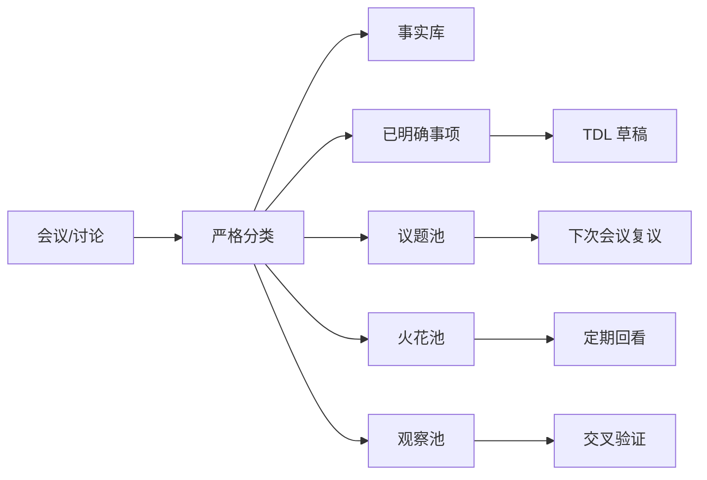

# 18 · 项目落地实现路径 V1 — 2026-05-18

## 一、先把愿景压回现实

`17-项目原始诉求与终局基线-V1` 给出的是终局方向。
本文件只回答一个问题：

> 这件事怎样一步一步做，才不是空中楼阁？

## 当前执行状态

截至 2026-05-18，项目先暂停新增功能开发。

暂停的目的不是停项目，而是先把本文件涉及的系统板块重新梳理一遍：日常 TDL、会议录入、非任务对象流转、企业知识层、跨系统事实源、插件、多 agent、协作 PR 流程。每一轮校准都应通过 Git PR 合并，避免文档和开发方向在本地临时漂移。

具体执行规则见：

- `19-系统板块重梳与PR推进计划-2026-05-18.md`
- `10-Codex-Claude-PR协作SOP.md`

核心原则：

1. 先让一个小闭环真实可用，再扩成复杂系统。
2. 先用已有系统和已有行为数据证明价值，再接更多平台。
3. 先把边界判定做准，再追求自动化程度。
4. 先做一个 owner 能真正验收的模块，再谈插件生态。
5. 当前阶段不允许为了“知识层愿景”提前建新表，除非日常 TDL 主链路和会议严格分类都已经通过验收。

## 二、五个落地维度

### 1. 技术层面

#### 当前已经具备的基础

- FastAPI 后端
- PostgreSQL
- 钉钉 Stream 机器人
- 钉钉日历授权
- APScheduler
- OpenAI + DeepSeek
- 现有 `meeting / decision / tdl / audit` 数据骨架

#### 还缺的关键能力

| 能力 | 当前状态 | 为什么重要 |
|---|---|---|
| 严格会议分类器 | 未完成 | 决定能否把事实、议题、火花、任务分开 |
| 企业知识对象 schema | 未落库 | 决定后续系统能否扩展 |
| 议题池 / 火花池 / 观察池 | 未实现 | 决定月会分析是不是只有 TDL |
| 跨系统事实接入层 | 未实现 | 决定未来能否接薪资、考勤、销售等系统 |
| 离线评测框架 | 只有雏形 | 决定 AI 能力是否可量化验收 |

#### 技术落地顺序

1. 先稳定日常 TDL 主链路
2. 再实现会议内容分层 schema
3. 再做会议离线解析与评测
4. 再补 `Issue / Idea / Signal` 三类对象
5. 再做企业知识对象最小表结构
6. 最后才开始跨系统接入

#### 当前阶段数据库边界

当前阶段只允许使用现有的 `meeting / decision / tdl / audit` 数据骨架承载试点数据，不新建知识层表。

原因：

1. 当前最大风险不是表不够，而是日常 TDL 主链路和会议分类边界还没有跑稳。
2. 过早建 `Fact / Goal / Issue / Idea / Signal / Relation` 等正式表，会把工程注意力从真实体验验证转移到 schema 设计。
3. 知识层实现属于阶段 3，在阶段 1-2 只做 schema 草案、离线文件和评测，不做正式落库扩展。

允许做：

- 在离线评测文件中模拟 `Fact / Issue / Idea / Signal` 结构。
- 在 `audit` 或现有 meeting 相关记录中保留最小来源信息。
- 写 schema 文档和测试样例。

不允许做：

- 新建正式知识层表。
- 为未来插件提前写复杂关系表。
- 把现有主链路改造成知识图谱优先架构。

### 2. 流程层面

#### 当前最需要建立的流程

| 流程 | 当前问题 | 目标状态 |
|---|---|---|
| 日常录入流程 | 能跑，但仍在体验验证 | Frank + 李珍稳定使用 |
| 月会后处理流程 | 还在探索 | 会后固定产出五类结果 |
| 议题升级流程 | 未建立 | `火花 -> 议题 -> 已明确事项 -> TDL` |
| 复盘流程 | 有周报，无完整组织复盘 | 任务结果、议题演化、线索变化可回看 |
| 规则回流流程 | 还依赖临时判断 | 真实错例能沉淀到规则文件 |

#### 推荐流程

#### 流程上的现实约束

1. 前期必须人工复核，不可能一开始全自动。
2. 议题、火花、线索要有“谁来回看”的 owner，否则只是换个地方堆积。
3. 每条链路都要有退出条件，不然系统只会越堆越多。

### 3. 工具、Skill、插件模块

#### 先不要一上来做“大而全插件”

建议把能力分成 3 层：

| 层 | 内容 |
|---|---|
| 核心能力 | intake、classification、TDL、提醒、周报 |
| 支撑能力 | meeting parser、judgment rules、offline evaluator、knowledge schema |
| 插件能力 | 战略蓝图、节奏把控、任务优化、经营策略优化 |

#### 先做哪些 Skill

1. `tdl-judgment-rules`
   - 委派识别
   - follow-up 纠错
   - 会议内容分层
   - `What + Who + When` 判定
2. `meeting-evaluation`
   - 召回
   - 误提
   - 伪决议
   - 编造日期
3. `knowledge-ingestion`
   - 事实
   - 决议
   - 议题
   - 火花
   - 线索

#### 插件何时开始做

只有满足以下前提后，才值得做上层插件：

1. 日常 TDL 有稳定真实数据
2. 月会分类连续跑过至少 2-3 轮
3. 知识对象 schema 已稳定
4. 至少接入 1 个外部事实源

否则插件只是漂亮的 demo。

### 4. 系统的交互性与关联性

#### 交互层

| 用户场景 | 最适交互 |
|---|---|
| 简单决策 | 按钮 |
| 复杂补充 | 自然语言 |
| 会议复议 | 摘要卡 + 可展开证据 |
| 火花回看 | 轻提醒，不做催办 |
| 观察线索 | 周期摘要，不做执行提醒 |

#### 关联层

系统必须逐步建立以下关联：

| 关联 | 例子 |
|---|---|
| 任务 -> 目标 | 某个 TDL 服务哪个经营目标 |
| 任务 -> 决议 | 这个任务由哪次会议哪个判断派生 |
| 议题 -> 决议 | 哪个议题在后续被解决 |
| 火花 -> 议题 | 哪个想法后来长成了正式讨论 |
| 线索 -> 风险 | 哪个早期苗头后来被证实 |
| 事实 -> 指标 | 哪些系统事实在支撑经营判断 |

#### 一个现实判断

如果没有这些关联，系统最多是“有很多列表”。
有了这些关联，才有资格谈“企业知识层”。

### 5. 多 agent 协作

#### 当前最现实的角色拆分

前期只采用：

1. **主流程 agent**
   负责完整链路：解析材料、生成候选对象、按规则分类、输出摘要和候选 TDL。
2. **专项审查 agent**
   只做一件事：检查主流程标为 `confirmed` 的内容是否真的满足 `What + Who + When`。

不要把“解析、判定、评测、汇总、执行、审核”拆成 6 个运行时 agent。它们当前只是业务流程步骤，不是独立 agent 边界。强拆会增加通信复杂度、调试成本和责任不清。

#### 专项审查 agent 的唯一目标

检查伪决议率。

它必须使用不同 prompt，从反方向追问：

> 这条内容真的同时具备 `What + Who + When` 吗？如果不具备，应该降级为 `pending / spark / signal` 中哪一类？

#### 何时值得扩展更多 agent

当同时满足：

1. 单 agent 已能稳定给出结构化候选
2. 规则足够清楚，可被独立 agent 检查
3. 离线评测集已经建立

再把流程拆成多个 agent 才有收益。

## 三、分阶段实施路线

### 阶段 0：把当前 MVP 收稳

目标：

- 日常助手在 Frank + 李珍范围内可稳定真实使用

必做：

1. 按钮端到端验证
2. follow-up 纠错继续打磨
3. 人名模糊匹配继续观察
4. pilot metrics 连续记录

退出条件：

- 两位真实用户连续使用
- 基础链路无高频误伤
- 按钮体验可信

### 阶段 1：把会议内容先分准

目标：

- 月会不再只抽任务，而是稳定产出：
  - 事实
  - 已明确事项
  - 待处理议题
  - 火花
  - 观察线索

必做：

1. 建 `meeting-classification` schema
2. 建 gold set
3. 严格验证伪决议率
4. 力争跑完 5 月月会非生产试点，但不把它作为 30 天内必须完成项

退出条件：

- 伪决议率接近 0
- `What + Who + When` 判定可靠
- Frank 对摘要不再有“熟悉又陌生”的错位感

### 阶段 2：让非任务对象开始流转

目标：

- `Issue / Idea / Signal` 不只被保存，还能流转

必做：

1. 议题池
2. 火花池
3. 观察池
4. 下次会议前复议提醒
5. 升级规则

退出条件：

- 至少 1 个火花成功升级为议题
- 至少 1 个议题后续形成决议
- 至少 1 个观察线索被后续事实验证或证伪

### 人机交接条件

前期所有会议分类结果都必须人工复核。AI 自主权只允许按以下条件逐步放开：

| 流程节点 | 默认状态 | 移交条件 |
|---|---|---|
| `confirmed -> TDL 草稿` | 人工复核后生成 | 连续 3 轮月会评测中，伪决议率为 0，且 `What + Who + When` 漏判可被人工接受 |
| `spark -> issue` | 人工决定升级 | 连续 3 次升级建议中，AI 建议被采纳率 >= 80% |
| `issue -> confirmed` | 必须人工确认 | 不建议完全自动化；至少保留人工确认按钮 |
| `signal -> risk` | 人工复核 | 同一信号被 2 个以上事实源或 2 轮会议材料交叉支持后，允许 AI 建议升级 |

即使满足移交条件，AI 也只能获得“建议权”，不能绕过用户确认直接发执行提醒。

### 阶段 3：建立企业知识层最小版本

目标：

- 让 `Fact / Goal / Task / Decision / Issue / Idea / Signal / Metric / Relation` 开始形成最小图谱

必做：

1. 最小 schema
2. 关系表
3. 来源追溯
4. 第一批跨系统事实源

建议先接：

1. 薪资
2. 考勤

退出条件：

- 一条经营判断可以回溯到多个事实源
- 一条任务可以回溯到决议和目标

### 阶段 4：开始上层插件验证

目标：

- 不追求全套插件，一次只验证一个

优先级建议：

1. 企业节奏把控
2. 任务优化
3. 企业战略蓝图
4. 经营策略优化

原因：

- 节奏把控最接近当前已有数据
- 任务优化次之
- 战略和经营策略需要更长时间的数据积累

## 四、哪些地方最容易失败

| 风险 | 具体表现 | 防御 |
|---|---|---|
| 边界错判 | 把设想变任务 | 先守 `What + Who + When` |
| 过早抽象 | 还没真实跑，就设计庞大知识图谱 | 先跑 2-3 轮月会 |
| 只做文档，不做流转 | 火花池最后变档案馆 | 每类对象都配提醒和升级机制 |
| 只做 AI，不改流程 | 人还是不复核、不回收 | 会后流程必须制度化 |
| 多 agent 过早 | 复杂度先上来，质量没提升 | 先单链路稳定，再拆 agent |
| 插件过早 | 漂亮但没有事实底座 | 至少一条外部系统事实源接通后再做 |

## 五、最现实的 90 天路线

### 0-30 天

1. 日常助手试点跑稳
2. 完成会议内容严格分类 schema
3. 建立 gold set 与伪决议审查口径
4. 5 月材料第一轮非生产评测作为力争项，不作为硬性交付

### 31-60 天

1. 完成 5 月材料第一轮非生产评测
2. 做第 2 轮会议分类试点
3. 设计议题池 / 火花池 / 观察池最小交互，不急于正式落库

### 61-90 天

1. 上线议题池 / 火花池 / 观察池最小版本
2. 验证议题和火花的跨月流转
3. 评估是否具备接入第一个外部事实源的条件
4. 只有当前三项通过后，才允许启动第一个上层插件原型

## 六、当前最重要的判断

这件事不是做不成，而是不能跳步骤。

最危险的路径是：

`刚有任务助手 -> 直接开始做企业战略蓝图`

最稳的路径是：

`可信任务助手 -> 连续会议系统 -> 企业知识层 -> 经营插件`

前者看起来快，后者才真的能落地。
