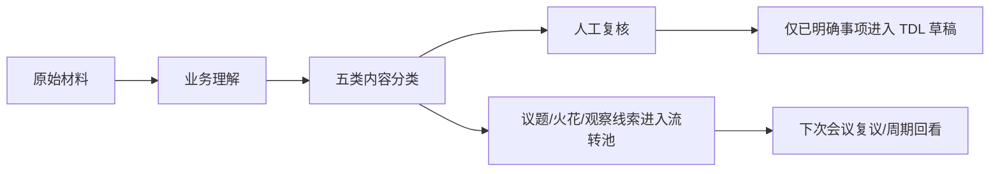
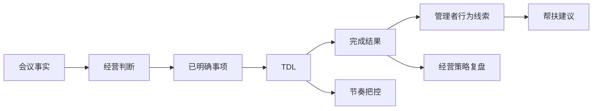

# 20 · 18 号落地路径逐块展开草案 — 2026-05-18

## 一、本文定位

本文不是替代 `18-项目落地实现路径-V1-2026-05-18.md`，而是把 18 号文档里的每个板块展开成可讨论、可审查、可拆 PR 的草案。

后续处理方式：

1. 本文先作为 18 号展开草案。
2. 经 Frank 和 Claude 审后，再决定是否沉淀为 `18-项目落地实现路径-V2`。
3. 在 V2 形成前，不直接修改 17 号冻结基线。
4. 本文仍遵守 `19-系统板块重梳与PR推进计划`：先校准路线，再恢复功能开发。

## 二、18 号第一块：先把愿景压回现实

### 1. 这块真正要解决的问题

17 号定义了终局愿景，但终局愿景太大，容易把开发带偏。18 号第一块的作用，是把“企业经营操作系统雏形”压回当前可执行路径：

> 先把一个可信的小闭环做稳，再让它长成知识层和插件体系。

这意味着当前所有开发判断都要先问三个问题：

1. 它能不能提升当前 TDL 主链路的可信度？
2. 它能不能减少会议内容被误判为任务的风险？
3. 它是不是必须现在做，还是只是未来愿景里的好东西？

如果答案不能支持当前闭环，就暂缓。

补充一条来自外部材料评估的设计原则：

> AI 负责高频整理、分类、追踪和候选生成；人负责边界判断、价值判断、辅导判断和最终执行授权。

这句话对应的管理原则是：“人做 AI 事则亏，AI 做人的事则险”。它不是一句口号，而是后续所有自动化边界的判断尺。

### 2. 当前最硬的边界

当前不是“停止推进”，而是“停止无边界加功能”。

近期允许做：

1. 文档路线校准。
2. 日常 TDL 试点验证。
3. 会议内容分类 schema 与 gold set。
4. 按钮、纠错、人名匹配等影响信任的主链路修复。
5. 离线评测框架。

近期不允许做：

1. 正式知识图谱建表。
2. 战略蓝图、经营策略优化等上层插件开发。
3. 多运行时 agent 拆分。
4. 把 5 月月会内容直接批量创建为正式 TDL。
5. 在会议材料里把意向、倡导、方向感包装成“已决议”。

### 3. 验收口径

这块不是靠“文档写得好”验收，而是靠后续行为是否被约束住：

| 验收点 | 合格标准 |
|---|---|
| 开发优先级 | 后续 PR 不再绕过 16/18/19 直接加上层功能 |
| 文档一致性 | 旧文档顶部能看到当前状态说明 |
| 会议边界 | 不满足 `What + Who + When` 的内容不会进入 TDL |
| PR 纪律 | 重要路线调整都经过 Git PR 和 Claude review |

## 三、18 号第二块：五个落地维度

### 1. 技术层面

#### 1.1 当前已有基础的真实价值

现有技术基础不是“已经完成系统”，而是已经具备搭建闭环的骨架：

| 基础 | 当前价值 | 不能过度解读为 |
|---|---|---|
| FastAPI 后端 | 能承载接口和服务编排 | 已经有完整平台能力 |
| PostgreSQL | 能保存 TDL、会议、审计等结构化数据 | 已经有企业知识层 |
| 钉钉 Stream 机器人 | 能在真实工作入口收发消息 | 交互体验已经成熟 |
| 钉钉日历授权 | 能把明确任务写入日历 | 日历就是最佳提醒形态 |
| APScheduler | 能跑提醒和周报 | 复杂节奏管理已完成 |
| OpenAI + DeepSeek | 能做解析和分类 | AI 判定已经可信 |
| `meeting / decision / tdl / audit` 骨架 | 能做试点承载 | 可以直接扩成知识图谱 |

核心判断：当前技术栈够支撑 MVP 和试点，但还不够支撑“自动经营判断”。

#### 1.2 技术层面的下一批硬能力

| 能力 | 近期动作 | 不做什么 |
|---|---|---|
| 严格会议分类器 | 先定 schema、gold set、评测口径 | 不直接上线自动建 TDL |
| 离线评测框架 | 用 5 月材料做对照组 | 不用主观“看起来不错”验收 |
| 按钮交互闭环 | 验证完成、暂缓、拒绝、忽略是否真的可点 | 不用卡片文字假装按钮 |
| 人名模糊匹配 | 先做小名单、别名、同音字维护 | 不追求全公司自动识别 |
| 会议 speaker 上下文 | 在 gold set 中标注说话人、岗位、职责范围 | 不先建正式人员档案表 |
| 事实源接入预研 | 先列薪资、考勤、销售等事实源字段 | 不先建统一大表 |
| 多源输入适配预研 | 先列述职、报表、绩效、招聘、销售摘要的输入差异 | 不在会议录入跑稳前扩输入源 |

#### 1.3 技术实现的节奏

短期技术目标不是“扩展”，而是“证明”：

1. 证明日常 TDL 可以被 Frank 和李珍真实使用。
2. 证明会议内容可以被严格分层，而不是被深加工。
3. 证明每一次 AI 输出都能追溯证据。
4. 证明错例可以回流到规则和评测集。

只有这四件事成立，后续知识层和插件才有意义。

### 2. 流程层面

#### 2.1 日常 TDL 流程

日常 TDL 不是简单“录入任务”，而是一条完整链路：


近期重点不是把链路拉长，而是把关键节点做可信：

1. 创建前：AI 不乱建。
2. 创建时：缺 owner / due_at 会追问。
3. 创建后：按钮可以真的操作。
4. 逾期后：用户能用最小动作处理。
5. 完成后：逐步回收结果，但不能增加太重负担。

#### 2.2 会议后处理流程

会议录入不能直接从“会议纪要”跳到“TDL”。正确链路应是：



关键边界：

| 类别 | 是否可直接转 TDL | 原因 |
|---|---|---|
| 事实 | 否 | 事实是依据，不是动作 |
| 已明确事项 | 可以进入 TDL 草稿 | 必须满足 `What + Who + When` |
| 待处理议题 | 否 | 还没有形成执行决议 |
| 火花和设想 | 否 | 价值在保存和回看，不在催办 |
| 观察线索 | 否 | 需要后续事实验证 |

#### 2.3 人机交接流程

AI 前期只拥有“建议权”，不拥有“执行权”。

| 节点 | AI 可以做 | 人必须做 |
|---|---|---|
| 会议分类 | 给候选类别和证据 | 复核边界是否准确 |
| 已明确事项 | 判断是否满足三要素 | 确认是否生成 TDL |
| 火花升级 | 提醒“这个火花多次出现” | 决定是否升级成议题 |
| 观察线索 | 汇总相似信号 | 判断是否构成风险 |
| 管理者画像 | 给数据线索 | 判断是否用于辅导 |

移交条件只意味着 AI 的建议权可以提高权重，不意味着 AI 可以绕过人。

外部材料进入项目时，也遵守同一条人机边界：

```text
外部材料 → Claude 适用性评估 → Codex 吸收与落地拆解 → Frank 拍板 → PR
```

这能避免外部方法论被直接工程化，也能保留三方分工：Claude 负责可行性质疑，Codex 负责落地拆解，Frank 负责业务判断。

### 3. 工具、Skill、插件模块

#### 3.1 三个概念要分开

| 概念 | 在本项目里的含义 | 例子 |
|---|---|---|
| 工具 | 系统内的功能入口或操作能力 | 按钮卡、日历写入、周报推送、离线评测脚本 |
| Skill | 给 AI 使用的稳定工作流说明 | 会议判定口径、TDL 纠错规则、月会分析流程 |
| 插件 | 建在知识层和 TDL 数据上的独立业务能力 | 企业节奏治理、任务与负荷优化、管理者赋能 |

不能把这三个混在一起。当前最应该先做 Skill 和工具，不应该马上做上层插件。

#### 3.2 外部成熟经验的借鉴

官方和社区的共识基本一致：

1. Skill 适合封装“重复发生、对流程一致性要求高”的工作。
2. Skill 不应写成大而全百科，而应是短小的作业指南，必要时挂参考资料、脚本和模板。
3. Skill 要通过真实任务迭代，而不是一次写完就认为稳定。
4. 社区 Skill 可以借鉴结构和思路，但企业核心管理 Skill 不能直接照搬，因为里面涉及权限、业务口径、人员评价和经营判断。

因此，本项目应该采取：

```text
官方原则借鉴 + 社区结构参考 + 本企业业务口径自建 + gold set 验证
```

#### 3.3 插件能力总图

你已提出的 4 类插件能力是：

1. 战略蓝图
2. 节奏把控
3. 任务优化
4. 经营策略优化

需要补充的第 5 类：

5. 管理者能力行为与管理水平优化

这里存在两组容易混淆的边界：

1. “节奏把控”和“任务优化”都接近 TDL，但前者看公司/部门周期是否断档，后者看具体任务是否可执行、是否过载。
2. “战略蓝图”和“经营策略优化”都接近经营判断，但前者看目标、方向、资源是否同向，后者看经营动作和结果之间是否有效。

因此建议把 5 类插件改名为更清晰的叫法：

| 插件 | 解决的问题 | 最小数据依赖 | 启动顺序建议 |
|---|---|---|---|
| 企业节奏治理 | 公司和部门节奏是否断档、挤压、拖延 | TDL 状态、会议节点、周期任务 | 1 |
| 任务与负荷优化 | 当前任务如何排优先级、拆解、减负 | TDL、依赖、逾期、阻塞 | 2 |
| 管理者赋能与组织能力发展 | 管理者在哪些行为上需要支持，团队能力怎样沉淀 | TDL 完成史、暂缓史、结果回收、员工反馈 | 3 |
| 战略对齐与蓝图管理 | 当前任务、决议、资源和经营目标是否同向 | Goal、Decision、Metric、Risk | 4 |
| 经营复盘与策略建议 | 经营动作和结果之间的关系是否有效 | 指标、销售、薪资、考勤、培训、招聘等事实源 | 5 |

旧叫法可以保留在历史语境中，但 18 V2 建议使用新叫法。尤其是“经营策略优化”应改成“经营复盘与策略建议”，避免系统听起来像能自动替人做经营决策。

此外，“岗位 Skill 化”和“业务流程化”不单独列成插件。它们是底层资产建设方式：岗位 Skill 化主要支撑“管理者赋能与组织能力发展”，业务流程化主要支撑“企业节奏治理”和“任务与负荷优化”。

#### 3.4 新增插件：管理者赋能与组织能力发展

这个插件对应你原来提出的“管理者能力行为与管理水平优化”。新叫法的重点是降低误解：它不应被理解成“给管理者打分”，而应被定义为：

> 基于任务行为、协作状态、结果反馈和员工档案，识别管理者需要被支持、提醒、训练或授权的具体方向。

##### 需要包含的档案

管理者档案：

| 字段组 | 示例 |
|---|---|
| 基础身份 | 姓名、岗位、品牌、校区、汇报关系 |
| 责任范围 | 负责业务线、团队人数、关键指标 |
| 任务行为 | 完成率、逾期率、暂缓率、拒绝率、补充信息频率 |
| 协作行为 | 等待他人次数、跨部门协作次数、阻塞来源 |
| 会议行为 | 提出议题、形成决议、遗留议题、火花贡献 |
| 结果回收 | 成功率、收益量级、反馈质量 |
| 成长记录 | 被辅导事项、训练动作、改进观察 |

员工档案：

| 字段组 | 示例 |
|---|---|
| 基础身份 | 姓名、岗位、校区、直属上级 |
| 任务参与 | 被分配任务、协作任务、反馈任务 |
| 反馈来源 | 员工反馈、家长反馈、市场反馈 |
| 能力线索 | 稳定性、执行反馈、培训记录 |
| 风险线索 | 考勤异常、任务长期未反馈、协作阻塞 |

员工档案中的外部事实源字段（如考勤、培训、招聘、销售反馈）在正式接入前只能作为占位设计；正式接入后也必须保留人工审核，不能让 AI 绕过来源校验直接形成对员工的风险判断。

##### 这个插件能输出什么

| 输出 | 面向谁 | 作用 |
|---|---|---|
| 管理者行为摘要 | Frank / 李珍 | 看管理者近期管理行为变化 |
| 帮扶建议 | Frank / 李珍 | 提醒该从哪一点辅导管理者 |
| 任务减负建议 | 管理者或上级 | 防止任务堆积导致系统失信 |
| 员工支持线索 | 管理者 | 哪些员工可能需要关注 |
| 会议复盘材料 | 月会前 | 看哪些议题反复出现但没有落地 |

##### 严格边界

1. 不直接给管理者贴“能力差”的标签。
2. 不把单次逾期推断成能力问题。
3. 不在事实不足时给强判断。
4. 不默认把画像推给本人，先给 Frank / 李珍作为辅导参考。
5. 所有判断必须能回溯到任务、会议、反馈或外部事实源。

#### 3.5 第一批 Skill 建议

第一批 Skill 不做“战略蓝图”这类宏大能力，而是做能让系统更稳的工作流。

| Skill | 用途 | 为什么先做 |
|---|---|---|
| `tdl-judgment-rules` | 日常 TDL 判断、追问、纠错、拒绝路径 | 直接影响用户信任 |
| `meeting-classification-strict` | 五类会议内容分类的总入口 | 防止伪决议 |
| `meeting-evidence-extraction` | 只提取证据片段，不做业务判断 | 防止摘要深加工 |
| `meeting-5w2h-gate` | 只判断 What / Who / When 是否齐全 | 防止意向被转成 TDL |
| `meeting-false-decision-review` | 只审伪决议、愿望包装和深加工 | 作为专项审查 agent 的规则底座 |
| `meeting-evaluation` | 召回、误提、伪决议、编造日期评测 | 让 AI 能力可验收 |
| `manager-profile-signal` | 管理者和员工档案中只抽“线索”，不下结论 | 为能力优化插件打底 |
| `outcome-recovery` | TDL 完成后的结果、收益、反馈回收 | 为复盘和管理画像提供数据 |

其中 `meeting-classification-strict` 是总入口，不应写成一个大而全的会议分析平台；真正执行时应拆成证据提取、三要素闸门、伪决议审查等原子动作。

其中 `manager-profile-signal` 只是上游线索抽取 Skill，负责把任务行为、结果回收、会议记录和外部事实源中的可疑信号整理出来；“管理者赋能与组织能力发展”是下游插件，负责在人工边界内把这些线索组织成辅导建议。Skill 不直接输出能力评价。

这些 Skill 的共同特点：

1. 都是窄任务。
2. 都能用样例验证。
3. 都直接服务主链路或后续数据积累。
4. 都不需要先建复杂知识层。

#### 3.6 插件启动门槛

任何插件启动前必须满足：

1. 有稳定输入数据。
2. 有明确输出对象。
3. 有误判风险边界。
4. 有人工复核点。
5. 有至少一组离线验收样例。

否则这个插件只能停留在文档设计，不进入开发。

### 4. 系统的交互性与关联性

#### 4.1 交互性：按钮优先，自然语言兜底

你的判断是对的：对于确认、忽略、拒绝、暂缓、完成这类明确动作，按钮比打字或语音更人性化。

推荐原则：

| 场景 | 首选交互 | 兜底 |
|---|---|---|
| 确认创建 | 按钮 | “确认/创建”文本 |
| 忽略草稿 | 按钮 | “忽略这条”文本 |
| 标记完成 | 按钮 | “完成 + 任务名” |
| 暂缓 | 按钮 + 时间选项 | “暂缓到明天/下周一” |
| 不是我的任务 | 按钮 | “不是我的任务 + 任务名” |
| 补充截止日期 | 自然语言 | 日期按钮候选 |
| 修正词汇/人名 | 自然语言 | 别名维护 |
| 复杂解释 | 自然语言/语音 | 人工处理 |

关键点：按钮是主路径，文本/语音是兜底路径。

#### 4.2 关联性：不能只做列表

系统未来的价值不在于“有很多列表”，而在于这些列表之间能互相传导：



近期要做的关联不是大图谱，而是最小来源追溯：

| 对象 | 至少要能追溯到 |
|---|---|
| TDL | 来源消息、会议片段或人工创建记录 |
| 已明确事项 | 会议证据、三要素 |
| 议题 | 来源会议、复议时间 |
| 火花 | 来源片段、回看周期 |
| 观察线索 | 来源证据、后续验证状态 |
| 管理者画像线索 | 任务行为、结果回收、反馈来源 |

### 5. 多 agent 协作

#### 5.1 当前只保留 1 + 1

当前最稳的拆法：

1. 主流程 agent：负责解析、分类、摘要、候选输出。
2. 专项审查 agent：只查伪决议，尤其查 `What + Who + When`。

不拆 6 个 agent。那些只是流程步骤，不是运行时边界。

#### 5.2 专项审查 agent 的审查问题

它只问几类问题：

1. 这条是否真的有明确 What？
2. 是否真的有明确 Who？
3. 是否真的有明确 When？
4. 这是不是愿望、倡导、建议、方向感，而不是决议？
5. 是否存在模型把上下文补全成了会议里没说出的内容？
6. 证据片段是否足够支持当前标签？

如果有任何一个问题无法通过，就必须降级。

#### 5.3 多 agent 的后续扩展条件

只有当以下条件满足，才考虑拆更多 agent：

1. 五类会议分类已经稳定。
2. gold set 足够大。
3. 主流程 agent 的错误类型已经可统计。
4. 专项审查 agent 能显著降低伪决议率。
5. 拆分后的收益大于调试成本。

## 四、18 号第三块：分阶段实施路线展开

### 阶段 0：当前 MVP 收稳

目标不是“全公司推广”，而是：

> Frank + 李珍两人愿意每天真实用，并且用完不困惑、不反感、不怕误操作。

必做动作：

1. 按钮端到端验证。
2. 文本/语音兜底验证。
3. follow-up 纠错验证。
4. 人名模糊匹配验证。
5. 日历写入与提醒呈现验证。
6. 逾期处理路径验证。
7. pilot metrics 连续记录。

退出条件：

1. 连续 2 周真实试用。
2. 无高频误建任务。
3. 无不可操作按钮假象。
4. 用户能清楚知道如何完成、暂缓、忽略、拒绝。
5. 系统能记录真实问题，而不是只靠口头反馈。

### 阶段 1：会议内容先分准

目标不是多抽任务，而是少造假任务。

必做动作：

1. 建 `meeting-classification-strict` schema。
2. 建 5 月月会 gold set。
3. 标注每条内容的证据来源。
4. 标注 speaker、岗位/职责范围、发言上下文。
5. 单独统计伪决议率。
6. 让 Frank 审“是否有熟悉又陌生感”。

退出条件：

1. 伪决议率接近 0。
2. 已明确事项必须满足三要素。
3. 未满足三要素的内容能正确进入议题、火花或观察线索。
4. 摘要中清楚区分事实、判断、分析。

### 阶段 2：非任务对象开始流转

目标不是保存更多内容，而是让内容有后续命运。

| 对象 | 流转方式 | 关闭方式 |
|---|---|---|
| 议题 | 下次会议复议 | 形成决议 / 明确搁置 / 取消 |
| 火花 | 周期回看 | 升级议题 / 保留 / 归档 |
| 观察线索 | 等待事实验证 | 证实为风险 / 证伪 / 继续观察 |

退出条件：

1. 至少一个火花升级为议题。
2. 至少一个议题形成明确事项。
3. 至少一个观察线索被事实验证或证伪。

### 阶段 2.5：多源输入适配层预研

目标不是一次接入所有资料，而是为“业务资产统一出入口”设计入口规范。

候选输入源：

1. 月会转录和个人提报。
2. 述职报告。
3. 经营报表。
4. 绩效考核结果。
5. 招聘进度。
6. 销售数据摘要。
7. 培训记录。

每接入一种输入源前，必须先回答：

| 问题 | 说明 |
|---|---|
| 来源可信度 | 这是原始事实、人工总结，还是二次分析？ |
| 结构化程度 | 是否有固定字段、周期、责任人？ |
| 输出对象 | 产出事实、议题、观察线索，还是 TDL 候选？ |
| 人工复核点 | 哪一步必须由 Frank / 李珍 / 业务负责人确认？ |
| 误判风险 | 错了会影响任务信任、人员评价，还是经营判断？ |

阶段 2.5 只做输入源规范和少量样例，不做大规模接入。

### 阶段 3：企业知识层最小版本

这阶段才开始考虑正式知识层。

最小版本只回答：

1. 哪些事实支撑了哪些判断？
2. 哪些判断派生了哪些任务？
3. 哪些任务产生了哪些结果？
4. 哪些结果反过来影响管理者画像和经营策略？

第一批事实源建议：

1. 薪资：成本、岗位、周期、激励。
2. 考勤：出勤、稳定性、异常、负荷线索。

销售、培训、招聘暂缓，因为它们解释空间更大，容易过早复杂化。

### 阶段 4：上层插件验证

插件启动顺序建议调整为：

1. 企业节奏治理
2. 任务与负荷优化
3. 管理者赋能与组织能力发展
4. 战略对齐与蓝图管理
5. 经营复盘与策略建议

原因：

1. 企业节奏治理最接近已有 TDL 和会议数据。
2. 任务与负荷优化能直接改善用户体验。
3. 管理者赋能与组织能力发展需要结果回收和档案数据，不宜过早。
4. 战略对齐与蓝图管理需要目标、指标、风险、决议稳定。
5. 经营复盘与策略建议需要多个事实源支撑。

## 五、18 号第四块：最容易失败的地方展开

| 风险 | 更具体的失败方式 | 防御动作 |
|---|---|---|
| 边界错判 | 把“我希望大家以后更主动用 AI”做成 TDL | 三要素不全就降级 |
| 深加工 | 把会议里一句方向感扩写成完整方案 | 每条结论必须带证据片段 |
| 插件过早 | 没有数据却开始做战略对齐或经营策略建议 | 插件必须满足启动门槛 |
| 画像伤信任 | 管理者觉得 AI 在贴标签 | 先只给 Frank / 李珍看线索 |
| 只存不流转 | 火花池最后变成档案馆 | 每类对象必须有回看/升级/关闭 |
| 交互失真 | 卡片里写“操作”但不能点 | 按钮必须端到端验证 |
| 社区 Skill 风险 | 引入不明 Skill 污染流程或泄露信息 | 只借鉴结构，不直接接入核心链路 |

## 六、18 号第五块：90 天路线展开

### 0-30 天

目标：可信小闭环。

交付：

1. PR-D 日常 TDL 试点验收闭环。
2. PR-B 会议分类 schema 与 gold set。
3. 第一版 `tdl-judgment-rules` Skill 草案。
4. 第一版 `meeting-classification-strict` Skill 草案。

不承诺：

1. 5 月材料完整非生产评测一定完成。
2. 知识层落库。
3. 插件开发。

### 31-60 天

目标：会议分类跑出可信评测。

交付：

1. 5 月材料第一轮人工基准。
2. 第一轮 AI 解析与人工基准对比。
3. 伪决议错例库。
4. 议题池 / 火花池 / 观察池的最小流转规则。

### 61-90 天

目标：让非任务对象开始跨月流转。

交付：

1. 议题池 / 火花池 / 观察池最小版本。
2. 下次会议前复议提醒。
3. 结果回收入口试点。
4. 管理者和员工档案字段草案。
5. 是否具备接入薪资或考勤事实源的评估。

## 七、当前建议

下一步不要直接写功能代码。

建议 PR 顺序：

1. 本文档作为 `PR-B0`：18 号逐块展开与插件补充草案。
2. Claude review 本文档，重点审插件顺序、管理者档案边界、Skill 优先级。
3. Frank 拍板后，形成 18 V2 或拆成多份专题文档。
4. 再进入 `PR-B`：会议分类 schema 与 gold set。

## 八、外部资料借鉴记录

本次只借鉴方法，不直接引入第三方 Skill。

参考方向：

1. OpenAI Academy 对 Skills 的定位：把已有工作方式变成可复用、可稳定执行的工作流。
2. Anthropic Claude Skills / Agent Skills 文档对 Skills 的定位：文件系统资源，包含流程、上下文、最佳实践和可选脚本。
3. Skill authoring best practices 的核心启发：Skill 要通过真实使用和迭代优化，而不是一次性写大而全说明。
4. 社区 Skill 市场的启发：可参考分类和结构，但不应直接接入企业核心管理链路。
