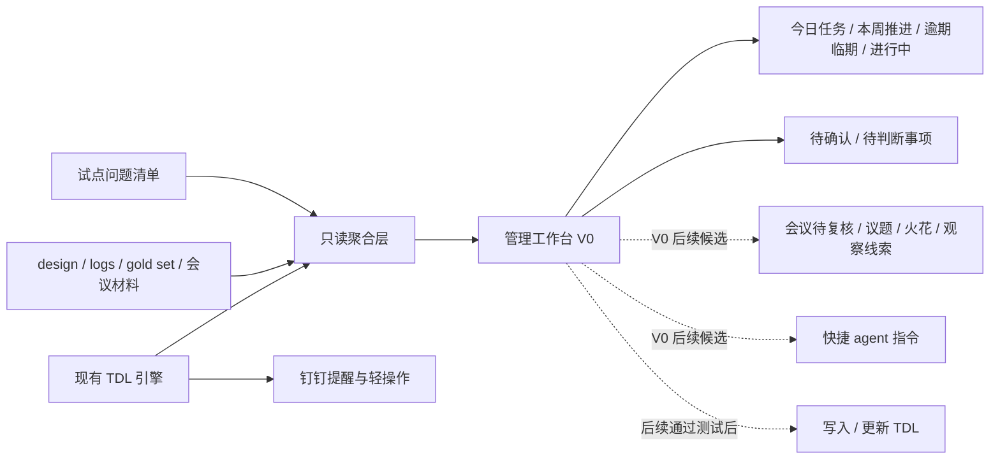
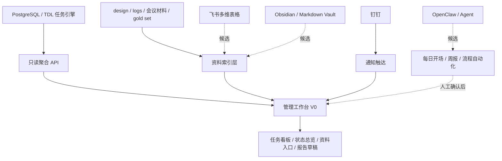

# 29 · 外部工作台与半路改造讨论整理 — 2026-05-24

## 一、本文用途

本文整理 Frank 与 Codex 围绕 TDL 管理交互系统后续方向的两轮讨论，供 Claude 进一步 review。

整理重点不是复刻原始对话，而是把讨论中的信息、判断、启发和待评估问题结构化，便于 Claude 从以下维度提出意见：

1. 该方向是否具备实施可能性。
2. 该方向相比当前钉钉任务卡路线的优势、风险和代价。
3. 若要推进，应该如何降低改造风险。
4. 是否存在更优或更稳妥的替代方案。

本文不包含 Frank 提供的截图原图，只提取截图和文案中对本项目有参考价值的产品结构与交互思路。

## 二、当前项目背景

TDL 管理交互系统当前定位已经从“任务助手”演进为“企业经营操作系统雏形”。根据 `17-项目原始诉求与终局基线`、`18-项目落地实现路径 V2` 和 `19-系统板块重梳与PR推进计划`，当前核心边界包括：

1. 当前暂停新增功能开发，先进行路线校准。
2. 当前主链路仍是日常 TDL 试点，重点验证 Frank + 李珍真实使用。
3. 会议录入不直接进入生产，必须先完成会议内容分类 schema、gold set 和伪决议评测。
4. 知识层、上层插件、多 agent 协作、跨系统接入均属于后续方向，近期不直接开发。
5. 开发方向、协作方式、验收标准等重大调整必须走文档 PR 和 Claude review。

这次讨论发生在上述背景下。Frank 的新问题不是简单要求新增功能，而是开始质疑当前“钉钉任务卡”作为主交互形态是否足够合理。

## 三、第一轮讨论：外部工作台、Obsidian + Agent、飞书、CodeGraph

### 3.1 Frank 的新观察

Frank 提到三个外部启发：

1. 有人使用 Obsidian + agent + 飞书，实现了知识、任务和交流的管理。
2. Frank 过去做过 OpenClaw，每天可以定时推送当日信息，这种方式似乎比当前钉钉任务卡更简单。
3. 当前项目围绕钉钉任务卡已经反复打磨很久，但仍未达到满意状态，说明“机器人制定任务 + 钉钉任务卡”的形态可能还不够成熟。

Frank 同时提到一个叫 CodeGraph 的工具，认为它可能能更好地管理项目文件夹，提高内容调用效率，希望参考。

Frank 还提供了一个外部工作台案例，包括截图和长文案。该案例展示的是一个类似 Obsidian 首页 / Home Console 的个性化工作台。

### 3.2 外部工作台案例的关键结构

该工作台案例的核心不是“好看的主页”，而是“每天打开就能完成工作启动和信息接收”的操作台。

从文案和截图中提取出的结构包括：

1. 顶部状态计数：
   - 今日日志是否已创建。
   - 今日待办数量。
   - 本周待办数量。
   - 逾期数量。
   - 进行中数量。

2. 快捷操作入口：
   - 创建任务。
   - 记录想法。
   - 记录选题。
   - 记录灵感。
   - 创建日志。
   - 每日开场。
   - 任务管理。
   - 笔记分诊。
   - 收件箱归档。
   - 选题规划。
   - 草稿打磨。
   - 视频数据分析。
   - 热点雷达。

3. 主要内容 tab：
   - 行动指北。
   - 内容创作。
   - 数据分析。
   - 稍后阅读。

4. 信息面板：
   - 今日要事。
   - 本周计划。
   - 逾期 / 临期 / 活跃任务笔记。
   - 12 周流程。
   - 内容创作相关入口。
   - 平台数据和视频表现。
   - AI 分析后的创作建议。
   - 收藏但尚未阅读的内容。

5. 标准化流程入口：
   - 文案中把这些入口称为 scales，本质是把日常重复动作变成标准化流程。
   - 用户点击某个流程按钮后，系统自动把对应指令填入输入框或终端，让 agent 开始检查文件、日志、计划并执行相应流程。

6. 个性化与低代码：
   - 用户不需要直接写代码，只需要说明想要什么、为什么需要。
   - AI 根据需求和风格参考生成对应页面、CSS 和功能调整。
   - 页面支持夜间 / 日间模式切换。

### 3.3 Codex 对第一轮的判断

Codex 的初步判断是：这些外部材料共同指向一个方向，即当前项目可能把“钉钉任务卡”放得过于中心。

更合理的分层可能是：

1. 钉钉卡片不应作为产品主体。
2. 钉钉更适合承担提醒、确认、轻操作入口。
3. 真正承载知识、任务、交流和经营节奏的，应当是一个管理工作台 / 首页操作台 / 管理控制台。

Codex 对不同形态的分工判断如下：

| 形态 | 更适合承担的职责 | 不适合承担的职责 |
|---|---|---|
| 钉钉机器人 / 任务卡 | 通知、提醒、确认、轻量状态操作、催办触达 | 复杂判断、长期回看、全局管理、知识组织 |
| 工作台 / Home Console | 全局查看、任务整理、会议复核、议题流转、知识回看、启动 agent 流程 | 高频即时通知、被动提醒 |
| 文件 / 知识库 | 原始材料、日志、会议、草稿、判断证据、可索引上下文 | 直接充当强交互界面 |
| 后端 TDL 引擎 | 任务入库、状态流转、提醒调度、日历联动、审计 | 承担完整的人机交互体验 |

因此，Codex 提出一个可能的新方向：

> TDL 管理交互系统应从“钉钉任务卡系统”校准为“企业管理工作台 + 钉钉触点 + agent 知识调用”。

### 3.4 对 CodeGraph 的初步调研与判断

Codex 对 CodeGraph 做了快速核对。GitHub 和相关站点上存在多个同名或近名项目，其中较贴近 Frank 描述的是本地代码知识图谱 / MCP 类工具，例如 `colbymchenry/codegraph`。

这类工具的大致定位是：

1. 对代码仓库做本地预索引。
2. 抽取文件结构、符号、函数、类、调用关系、导入关系等。
3. 形成本地 SQLite 或类似存储中的语义 / 结构图谱。
4. 通过 CLI 或 MCP server 暴露给 Claude Code、Codex、Cursor 等 agent。
5. 减少 agent 反复使用 grep、glob、read 扫文件造成的 token 浪费和上下文噪音。

Codex 的判断是：

1. CodeGraph 类工具适合解决“AI 如何更快理解代码仓库结构”的问题。
2. 它对本项目的研发协作可能有帮助，尤其本项目设计文档多、业务规则多、代码和文档关系复杂。
3. 但它不是业务产品形态，不能直接替代任务系统、工作台或知识层。
4. 更适合把它作为研发提效和影响面分析工具，而不是当前产品路线的主轴。

### 3.5 第一轮形成的方向建议

Codex 建议不是推翻 TDL，而是重新分层：

1. TDL 任务引擎继续保留。
   - 现有入库、提醒、逾期、状态回收、日历等能力仍有价值。

2. 钉钉卡片降级为触点。
   - 不再把卡片做成完整管理界面。
   - 只承担提醒、确认、补充、完成、暂缓、拒绝等轻操作。

3. 新增“管理工作台”作为主界面。
   - 第一版服务 Frank 自己每日打开使用。
   - 聚合今日任务、本周推进、逾期、会议待复核、议题池、火花池、观察线索、快捷 agent 指令等。

4. 知识层先用文件和轻结构承载。
   - 不急于建设正式知识图谱表。
   - 先让会议、日志、任务、观察、议题成为可读、可索引、可被 agent 调用的材料。

5. CodeGraph 类工具作为研发提效试点。
   - 可单独评估是否接入 Codex / Claude 工作流。
   - 不进入业务主链路。

Codex 同时指出：由于这属于开发方向调整，不应直接进入代码开发，而应新增文档 PR，交给 Claude review，再由 Frank 拍板。

## 四、第二轮讨论：用 Codex 重构老代码的模块选择标准

### 4.1 Frank 提供的笔记

Frank 继续提供一条关于“使用 Codex 重构老代码”的笔记，认为如果项目要半路改造，该思路会有帮助。

该笔记的核心问题是：开发者用 AI 重构老代码时，常因为模块选择不当，导致“改一个地方牵动半个项目”，甚至需要长时间回滚。根本原因是缺乏科学的模块隔离标准。

笔记提出三个模块选择标准：

1. 依赖度评估：优先选择叶子模块。
   - 通过 Codex 做静态分析，输出模块间调用关系依赖图。
   - 高风险节点包括出度高、入度低的模块，改动可能引发连锁反应。
   - 优先选择出度低、入度也低的真叶子模块，影响面最小。

2. 测试覆盖度：以测试作为安全网。
   - 优先重构已有单元测试的模块。
   - 没有测试的模块，应先用 Codex 补充测试，再改代码。
   - 测试可以作为验证标准，降低回滚成本。

3. 业务边界：判断职责是否单一。
   - 如果一个模块无法用一句话讲清楚功能，说明它可能耦合过深。
   - 优先选择职责单一、接口少的模块。
   - 耦合深的模块留到后期处理。

笔记还强调一个常见误区：

1. 不能只按代码行数选择“小模块”。
2. 小体积公共工具类可能被大量业务引用，反而是隐形高风险点。
3. 代码行数小不等于依赖少。

### 4.2 Codex 对第二轮的判断

Codex 判断这条笔记非常贴合当前 TDL 项目的处境。

如果要把项目从“钉钉任务卡主导”改造成“管理工作台 + 钉钉触点 + agent 知识调用”，不能一开始就改核心链路。否则会同时牵动：

1. 钉钉 Stream 机器人。
2. TDL 服务。
3. 日历写入。
4. 提醒调度。
5. AI 解析。
6. 数据库模型。
7. 按钮回调和状态流转。

这类改动容易从产品方向调整变成大范围返工。

### 4.3 Codex 提出的项目改造原则

Codex 将 Frank 的笔记转化为适用于当前项目的半路改造原则：

#### 4.3.1 先找叶子模块，不碰主链路

第一阶段不应直接改：

1. `app/integrations/dingtalk`。
2. TDL 核心模型。
3. 提醒调度。
4. AI 解析主流程。
5. 日历写入主流程。
6. 状态流转核心逻辑。

更适合先动的是读取型、展示型、离线型、旁路型模块，例如：

1. 试点验收数据汇总。
2. 任务状态只读查询接口。
3. 会议分类结果只读面板。
4. `logs / design / gold set` 的索引与展示。
5. 一个不写库、不发钉钉的本地工作台 prototype。

#### 4.3.2 先做旁路工作台，不替换现有系统

工作台第一版应只读取现有任务、文档、会议标注、试点问题清单，形成首页。

第一版不应：

1. 创建正式任务。
2. 修改任务状态。
3. 发送钉钉消息。
4. 写入日历。
5. 自动改变生产数据。

这样即使方向不对，也不会破坏现有生产链路。

#### 4.3.3 先补安全网，再改业务行为

如果后续要让工作台具备创建或更新 TDL 的能力，必须先补测试和验证，包括：

1. TDL 状态流转测试。
2. 钉钉按钮回调测试。
3. 人名匹配测试。
4. 日历写入边界测试。
5. AI 解析降级 / 追问测试。

#### 4.3.4 用一句话约束第一版工作台范围

工作台第一版不应做成大一统平台，而应只回答一句话：

> Frank 每天打开后，能一眼看到今天该处理什么、哪些事卡住了、哪些内容需要复核。

如果第一版的职责无法用这句话约束，就说明范围再次膨胀。

#### 4.3.5 CodeGraph 放在改造前置分析，而不是产品主线

CodeGraph 类工具可用于：

1. 生成依赖图。
2. 辅助影响面分析。
3. 帮助 Codex / Claude 更快理解项目结构。
4. 识别高风险核心链路和低风险旁路模块。

即使暂不接入 CodeGraph，也可以用现有工具先做轻量版：

1. 使用 `rg` 查调用点。
2. 使用测试覆盖率工具查看覆盖情况。
3. 通过静态 import 分析模块依赖。
4. 手工列出核心链路和旁路模块。

### 4.4 第二轮形成的原则句

Codex 建议把该思路吸收到后续路线文档中，形成明确原则：

> 半路改造必须采用旁路优先、只读优先、叶子模块优先、有测试再写入的策略。

这条原则的目的不是阻止方向调整，而是防止因为看到更好的产品形态，就直接推翻已有稳定部分。

现有 TDL 能力不应废掉，而应成为工作台背后的任务引擎。

## 五、综合后的可能新路线

基于两轮讨论，当前可以整理出一个候选路线：

该路线的关键不是立即新建完整平台，而是先做一个低风险 V0：

1. 只读。
2. 本地或内网使用。
3. 不替换钉钉。
4. 不改变生产数据。
5. 先服务小范围真实试验，而不是只服务 Frank 个人。
6. 从真实使用中验证工作台是否比钉钉任务卡更适合作为主交互面。
7. 会议待复核、议题池、火花池和快捷 agent 指令只作为 V0 后续候选，不进入第一批强范围。

## 六、需要 Claude 重点评估的问题

请 Claude 重点从以下问题给出 review：

### 6.1 方向判断

1. 将项目从“钉钉任务卡主导”校准为“管理工作台 + 钉钉触点 + agent 知识调用”，是否符合 `17 / 18 / 19` 当前项目基线？
2. 这个方向是否会削弱当前“可信任务助手”阶段目标，还是反而更容易实现该目标？
3. 钉钉卡片降级为触点是否合理？有没有被低估的价值或风险？

### 6.2 实施可能性

1. 在当前 FastAPI + PostgreSQL + 钉钉 Stream 机器人架构下，做一个只读管理工作台 V0 是否现实？
2. V0 应该优先读取哪些数据源，哪些数据源暂时不要碰？
3. 是否应该先做静态页面 / 本地页面 / 后端只读 API / 简单前端，哪种实现成本和风险最低？

### 6.3 风险点

1. 工作台方向是否会导致项目范围再次扩大，从日常 TDL 试点滑向“大而全管理平台”？
2. 如果先做旁路只读工作台，是否仍然会分散当前 PR-D 日常 TDL 试点验收闭环？
3. 现有任务引擎、提醒、钉钉交互中哪些部分最容易被误改，应列为禁止触碰区？
4. 工作台若接入 agent 指令，是否会引入新的自动化误判风险？

### 6.4 改造策略

1. “旁路优先、只读优先、叶子模块优先、有测试再写入”是否足够作为半路改造原则？
2. 在本项目中，哪些模块属于适合作为 V0 的叶子模块？
3. 哪些测试必须先补，才能允许工作台从只读升级为写入？
4. 是否需要先做依赖图 / 影响面分析，再决定具体开发顺序？

### 6.5 CodeGraph / 代码知识图谱

1. 是否建议把 CodeGraph 类工具纳入 Codex / Claude 的研发辅助流程？
2. 如果纳入，它应该只服务代码理解和依赖分析，还是也可以索引设计文档与业务资料？
3. 该类工具是否存在配置、维护、误导、上下文污染或安全风险？
4. 在当前阶段，使用 `rg`、测试覆盖率、import 分析等轻量手段是否已经足够？

### 6.6 替代建议

1. 是否存在比“管理工作台 V0”更小、更稳的验证方式？
2. 是否可以先用纯 Markdown / Obsidian / 静态 HTML 方式模拟工作台，而不进入正式系统开发？
3. 是否应先把这次讨论写入 `21-外部材料借鉴与评估` 的后续版本，还是新开独立文档 PR？
4. 如果 Claude 不建议立即开发工作台，应建议保留哪些设计原则进入后续路线？

## 七、Codex 当前倾向

Codex 当前倾向如下，供 Claude 挑错：

1. Frank 的新观察是有效的，说明当前钉钉任务卡作为主交互面的上限可能较低。
2. TDL 项目不应推翻现有任务引擎，而应重新分层：任务引擎在后，工作台在前，钉钉作为触点。
3. 工作台方向与原始终局愿景并不冲突，反而更接近“企业经营操作系统雏形”的交互入口。
4. 当前不宜直接开发完整工作台，应先形成文档 PR，并让 Claude review。
5. 如果后续开发，第一版必须是旁路、只读、低风险、服务 Frank 自己每日启动的 V0。
6. CodeGraph 类工具可以作为研发提效和影响面分析工具，但不应混入业务产品路线。
7. 半路改造必须采用“旁路优先、只读优先、叶子模块优先、有测试再写入”的策略。

## 八、建议的下一步

如果 Claude 认可大方向，建议下一步不是立即写代码，而是新增或更新路线文档，明确：

1. 钉钉任务卡从主交互面降级为提醒与轻操作触点。
2. 管理工作台作为候选主交互面进入阶段性验证。
3. 工作台 V0 只做只读聚合，不写库、不发钉钉、不改状态。
4. 任何写入能力必须在测试和真实验证补齐后再开放。
5. CodeGraph / 依赖图分析作为改造前置评估手段，而非业务功能。

如果 Claude 不认可立即调整路线，也请至少评估是否应把上述“半路改造原则”纳入后续 PR-E 恢复功能开发前的约束条件。

## 九、Claude 反馈后的补充共识

### 9.1 对 Claude 两轮反馈的吸收与修正

Claude 第一轮反馈强调 `18 V2 / 19` 中“先把可信小闭环做稳”的阶段约束，认为管理工作台方向正确但时机需要斟酌，建议先完成 PR-D 日常 TDL 试点闭环，再把工作台放入 PR-E 候选。

Frank 对此提出修正：评价当前方向时，应优先参考 `17-项目原始诉求与终局基线`，因为 `17` 才是项目最终目标的方向锚点。如果钉钉任务卡作为主交互面的上限较低，继续投入完整试点验收可能是在错误方向上做正确动作。及时止损比完成旧方向的验收更重要。

Claude 第二轮接受该修正，并重新判断：

1. 钉钉卡片无法承载 `17` 中强调的管理连续性、判断力和节奏感。
2. 钉钉适合消息触达，不适合作为长期管理界面。
3. 工作台更接近“每天打开后看到全局画面、横向对比、纵向追踪”的终局入口。
4. 如果方向本身存在问题，越早转向越划算。

Codex 对 Claude 第二轮的吸收意见如下：

1. “钉钉从界面降为通道”是一个更准确的表述，应优先采用。
2. 钉钉任务卡不应继续作为主交互面重投入。
3. 钉钉仍应保留通知触达价值，尤其是提醒、催办、待确认通知和协作者触达。
4. PR-D 不应简单废弃，而应重写目标：从“验证钉钉任务卡是否可推广”调整为“验证钉钉作为主界面的上限，并沉淀工作台迁移需求”。
5. 工作台方向可以进入优先验证，但不能未经 V0 验证就宣布完全替代钉钉任务卡。

### 9.2 钉钉任务卡的新定位

当前共识不是简单“保留钉钉”或“砍掉钉钉”，而是拆开两种职责：

| 职责 | 当前判断 |
|---|---|
| 钉钉作为复杂管理界面 | 不再继续重投入，后续应逐步退役 |
| 钉钉作为通知触达通道 | 保留，仍有不可替代价值 |
| 钉钉复杂任务卡和多按钮流 | 冻结优化，不新增复杂能力 |
| 钉钉简洁提醒和跳转入口 | 可保留，例如逾期提醒、待确认提醒、协作通知 |
| 工作台 | 作为候选主交互面进入验证 |

更准确的方向表述是：

> 工作台承载管理视角，钉钉承载触达能力。钉钉任务卡不再作为主界面继续投入。

这意味着后续不应继续围绕钉钉复杂卡片体验做大量修修补补，但也不应在工作台验证前物理删除现有钉钉链路。

### 9.3 试验对象需要覆盖小团体，而不是只服务 Frank

Frank 补充指出，后续试验不能只围绕个人使用体验。

当前应区分三类角色：

| 角色 | 试验价值 |
|---|---|
| Frank | 最终业务裁决者和管理视角使用者，判断系统是否真的服务经营管理 |
| 李珍 | 业务层面理解深度和真实使用体验的关键代表，应作为业务用户体验主参照 |
| 荆少巍 | 技术开发和实现视角代表，可验证开发、部署、维护和技术可操作性 |

因此，工作台 V0 不能被定义成 Frank 个人效率工具。它第一阶段可以从 Frank 的每日管理启动切入，但验证对象应覆盖 Frank + 李珍 + 荆少巍的小范围试验关系。

其中，业务层面的体验判断应更重视李珍：

1. 李珍是否能理解工作台展示的信息。
2. 李珍是否觉得任务、提醒、确认、待处理事项更清楚。
3. 李珍是否能接受从钉钉复杂卡片转向“钉钉提醒 + 工作台查看/处理”的分工。
4. 李珍是否仍需要保留某些钉钉内操作，以降低切换成本。

荆少巍的价值则更偏技术试验：

1. 工作台部署和维护是否简单。
2. 只读聚合层是否容易扩展。
3. 与现有 TDL 引擎、钉钉提醒、数据库结构是否能低耦合集成。
4. 后续如果开放写入，哪些模块风险最高、测试缺口最大。

这个补充改变了 V0 的评估口径：工作台不是“Frank 自己每天打开是否舒服”即可通过，而是要证明它能服务公司小团体的真实协作。

### 9.4 PR-D 的目标应重写

原 PR-D 目标偏向验证 Frank + 李珍两人能否通过钉钉任务卡完成日常 TDL 试点闭环。

在当前共识下，PR-D 不应继续沿用“钉钉任务卡是否可推广”的验收口径，而应调整为：

1. 识别钉钉任务卡作为主交互面的体验上限。
2. 区分哪些能力必须迁移到工作台，哪些能力应保留在钉钉通知通道。
3. 收集 Frank + 李珍真实使用中的卡点、误解和低效操作。
4. 形成工作台 V0 的最小需求，而不是继续扩大钉钉卡片功能。
5. 保留现有钉钉链路作为过渡，不立即物理删除。

这样处理后，PR-D 仍然有价值，但它的价值从“证明旧方向成立”变成“为转向提供真实依据”。

### 9.5 工作台 V0 的范围需要进一步收缩

为避免被外部案例的功能密度带偏，工作台 V0 应按强范围和候选范围拆开。

V0 强范围：

1. 今日任务。
2. 本周任务。
3. 逾期 / 临期。
4. 进行中。
5. 待确认 / 待判断事项。

V0 暂不进入：

1. 会议待复核。
2. 议题池。
3. 火花池。
4. 观察线索。
5. 快捷 agent 指令。
6. 内容创作、数据分析、热点雷达等外部案例中的个人创作者模块。

原因是：会议复核和议题流转一旦进入 V0，工作台很容易从“每日任务启动台”膨胀为“经营知识系统”。这会直接违反当前“先验证主交互面是否成立”的目标。

### 9.6 半路改造原则必须正式化

Frank 再次强调，关于使用 Codex 重构老代码的模块选择标准和避坑指南必须重视，因为这次改造会涉及旧链路取舍和结构调整。

该原则应从讨论建议上升为后续改造约束：

> 半路改造必须采用旁路优先、只读优先、叶子模块优先、有测试再写入的策略。

具体执行口径：

1. 不按代码行数判断改造风险。
2. 先看模块依赖关系，优先选择低入度、低出度、职责单一的叶子模块。
3. 不先改钉钉 Stream、提醒调度、日历写入、AI 解析、TDL 状态流转等核心链路。
4. 工作台 V0 先通过只读 API 或静态聚合读取现有数据。
5. 没有测试覆盖的写入能力不开放。
6. 开放写入前必须补 TDL 状态流转、钉钉通知、日历边界、人名匹配、AI 解析降级等测试。
7. 任何“顺手加一个创建按钮 / 状态按钮 / agent 执行入口”的需求，都必须先回到上述原则审查。

这条原则不只适用于工作台，也应成为后续所有 PR-E 恢复功能开发前的通用约束。

### 9.7 对 `17 / 18 / 19` 的文档处理建议

当前不建议直接修改 `17`。

原因：

1. `17` 是冻结版原始诉求与终局基线，文档自身明确要求后续修订只能新建 V2 / V3，不回写。
2. 这次讨论并不是推翻 `17`，而是重新强调 `17` 应作为方向锚点。
3. 修改 `17` 会破坏冻结基线的作用，反而增加后续追溯成本。

`18 / 19` 确实需要后续校准，但不应在本文中顺手完成。

建议后续新增正式路线文档，例如：

1. `18-项目落地实现路径-V3-2026-05-24.md`，用于调整当前落地路径。
2. 或新增 `30-管理工作台与钉钉通道化路线校准-2026-05-24.md`，作为独立方向校准文档。

该正式路线文档应更简洁，不再完整复述讨论过程，只固化决策：

1. `17` 是方向锚点，阶段路线不得与其冲突。
2. 钉钉任务卡不再作为主交互面继续重投入。
3. 钉钉保留为通知触达通道。
4. 工作台进入候选主交互面验证。
5. PR-D 目标调整为止损评估和迁移需求沉淀。
6. V0 严格只读、旁路、小团体验证。
7. 半路改造遵守依赖、测试、业务边界三重约束。

### 9.8 当前共识摘要

截至本轮讨论，较稳的共识可以概括为：

1. `17` 的终局基线优先于 `18 / 19` 的阶段安排；当阶段安排和终局方向冲突时，应及时校准阶段路线。
2. 钉钉任务卡不再作为主交互面继续重投入。
3. 钉钉保留为通知触达通道，而不是复杂管理界面。
4. 工作台进入候选主交互面验证，但必须先做只读 V0。
5. 当前 PR-D 应从“验证钉钉任务卡是否可推广”改为“验证钉钉作为主界面的上限，并沉淀工作台迁移需求”。
6. 工作台 V0 的试验对象应覆盖 Frank + 李珍 + 荆少巍，而不是只服务 Frank 个人。
7. 李珍是业务理解和真实使用体验的重点参照，荆少巍是技术开发和可维护性参照。
8. 工作台 V0 第一批只看今日、本周、逾期 / 临期、进行中、待确认 / 待判断事项。
9. 会议知识层、议题池、火花池、观察线索和 agent 指令不进入 V0 强范围。
10. 钉钉任务卡代码先冻结复杂优化，不立即删除；待工作台验证通过后再规划退役。
11. CodeGraph 类工具暂不进入业务主线，可作为后续研发辅助候选。
12. 半路改造必须正式采用旁路优先、只读优先、叶子模块优先、有测试再写入的策略。

## 十、视频拆解后的技术实现诉求补充

### 10.1 视频材料的参考边界

Frank 后续补充了外部工作台视频，视频文件为本地录屏材料。该视频展示的是一个个人 Obsidian / agent 首页工作台，包含状态计数、快捷入口、分区 tab、任务/阅读/内容数据面板、AI 辅助生成页面和本地文件组织等内容。

该视频可以参考，但必须谨记本项目的开发诉求：

1. 不因对方的内容创作者工作性质带偏。
2. 不把 Obsidian 本身当成核心目标。
3. 不照搬其内容创作、热点雷达、视频数据分析等个人生产力模块。
4. 只提取对企业小团体任务管理、资料流转、提醒、看板和报告有价值的产品机制。
5. 技术选型服务于 TDL 项目目标，而不是为了追随某个工具栈。

### 10.2 视频中真正值得借鉴的机制

从视频和此前文案中，可以抽象出以下可借鉴机制：

| 外部工作台机制 | 对 TDL 项目的可借鉴点 | 是否进入 V0 |
|---|---|---|
| 顶部状态计数 | 让用户一眼看到今日、本周、逾期、进行中等关键状态 | 进入 |
| 快捷创建入口 | 降低任务、想法、日志、问题记录的录入成本 | V0 可保留入口概念，但先不开放复杂写入 |
| 分区 tab | 把行动、数据、资料、报告分区，避免首页堆满 | 进入，但 V0 tab 数量要少 |
| 今日要事 / 本周计划 | 每日管理启动的核心视角 | 进入 |
| 逾期 / 临期 / 活跃任务 | 管理追踪和节奏感的关键 | 进入 |
| 标准流程入口 | 把重复管理动作固化为流程，例如每日开场、周回顾 | V0 后续候选，先不接 agent 执行 |
| 资料入口 / 索引入口 | 快速进入资料库、会议材料、制度、报告 | V0 可做只读入口 |
| 数据来源提示 | 明确每个面板的数据从哪里来，降低误信 AI 输出风险 | 应进入 |
| 明暗主题 / 视觉风格 | 提升使用意愿，但不是核心 | 非优先 |
| AI 自动改页面 / CSS | 可作为开发方式参考，不是产品能力 | 不进入产品范围 |

核心借鉴结论：

> 我们要学的是“每天打开后的管理启动台”和“重复动作标准化”，不是学它的创作者内容生产系统。

### 10.3 TDL 工作台应覆盖的技术能力清单

结合 Frank 补充的技术层面诉求，后续工作台方向应关注以下能力。

#### 10.3.1 任务创建

目标不是简单加一个创建按钮，而是形成可控的任务录入流程：

1. 支持快速创建任务草稿。
2. 缺负责人、截止时间、完成标准时必须追问或标记为不完整。
3. 初期可只生成草稿，不直接生成正式 TDL。
4. 创建入口需要区分任务、想法、待判断事项、资料线索，避免所有输入都被包装成任务。
5. 写入正式任务前必须有测试覆盖和确认机制。

#### 10.3.2 待办列表

工作台 V0 的待办列表应比钉钉卡片更强调管理视角：

1. 今日待办。
2. 本周待办。
3. 逾期 / 临期。
4. 进行中。
5. 待确认 / 待判断。
6. 按负责人筛选。
7. 按业务线筛选。
8. 按状态和优先级筛选。

V0 不追求复杂项目管理能力，只先证明“打开后能一眼知道现在该处理什么”。

#### 10.3.3 提醒机制

提醒机制应从“钉钉复杂任务卡”转向“通知通道 + 工作台处理”：

1. 钉钉保留主动触达，用于逾期、临期、待确认、协作提醒。
2. 钉钉消息尽量简洁，不承载复杂管理界面。
3. 工作台承载完整上下文和后续处理。
4. 后续可支持从钉钉提醒跳转到工作台详情页。
5. 对李珍等业务用户，是否保留少量钉钉内轻操作，需要通过试验验证。

#### 10.3.4 仪表盘看板

仪表盘不是为了好看，而是服务管理判断：

1. 今日状态：今日任务、今日新增、今日完成、今日待确认。
2. 本周状态：本周推进、本周逾期、本周风险。
3. 人员状态：Frank、李珍等小范围试验对象的任务分布。
4. 业务线状态：励步英语、斯坦星球等业务线维度。
5. 风险状态：逾期、反复延期、无人负责、缺完成标准。
6. 数据来源：每个数字应说明来自任务表、日志、钉钉回调、人工标注还是文件。

V0 可只做任务维度仪表盘，不接入薪资、考勤、销售等外部事实源。

#### 10.3.5 资料数据管理

资料数据管理是后续企业知识库的基础，但 V0 不应直接建设正式知识图谱。

近期更稳妥的做法：

1. 先建立资料入口和索引，而不是新建复杂知识层。
2. 资料包括会议材料、述职材料、设计文档、试点日志、gold set、业务规则。
3. 每个资料入口应保留原文路径、来源、时间和用途。
4. AI 可以辅助检索和摘要，但必须能回到原始材料。
5. 与任务相关的资料可以在工作台中只读关联，先不做自动归因和自动决策。

#### 10.3.6 权限专属

工作台如果面向公司小团体，权限不能后补。

至少需要提前考虑：

1. Frank 视角：全局管理、最终裁决、跨业务线查看。
2. 李珍视角：业务执行相关任务、待确认事项、自己负责或协作的内容。
3. 荆少巍视角：技术开发、部署、维护、日志、测试和问题排查。
4. 后续其他管理者：只看与自己相关的任务和报告。
5. 敏感资料：薪资、绩效、人事、经营数据必须有独立权限边界。

V0 可以先用简单账号或内网访问控制，但权限模型要在设计上预留，不能默认所有用户看到同一张大屏。

#### 10.3.7 报告产出

报告产出应服务管理闭环，而不是堆砌 AI 总结：

1. 每日摘要：今日新增、今日完成、今日逾期、待确认。
2. 每周推进报告：本周重点、延期事项、风险事项、下周建议。
3. 个人任务报告：某个管理者的任务承担、完成、延期、协作情况。
4. 业务线报告：某条业务线的推进节奏和卡点。
5. 试点报告：Frank + 李珍 + 荆少巍试验中的真实问题和改进项。

报告必须区分事实、判断和建议，不能把 AI 推断包装成既定结论。

### 10.4 可选技术支撑的定位

当前讨论涉及飞书多维表格、钉钉平台、Obsidian、OpenClaw agent、CodeGraph 等技术支撑。建议按职责拆开，不要把它们混成一个方案。

| 技术支撑 | 可能价值 | 当前建议 |
|---|---|---|
| FastAPI + PostgreSQL | 现有任务引擎、状态流转、提醒调度、权限和 API 基础 | 继续作为主后端 |
| 钉钉平台 | 公司现有工作入口、主动触达、提醒、协作通知 | 保留为通知通道，冻结复杂任务卡重投入 |
| 飞书多维表格 | 低代码数据表、人工维护、视图筛选、轻量协作 | 可作为资料/试点看板候选，但不应替代主数据源前先评估 |
| Obsidian | 本地知识库、Markdown 资料组织、双链和插件生态 | 作为企业知识库技术可行性参考，不作为 V0 必选 |
| OpenClaw agent | 定时推送、每日开场、自动汇总、流程 agent | 可作为后续流程自动化参考，V0 不授予执行权 |
| CodeGraph | 代码/文档依赖分析、辅助 AI 理解项目 | 作为研发辅助候选，不进入业务主线 |
| 静态 HTML / 轻前端 | 快速验证工作台信息架构 | 可作为 V0 高效实现方式 |

### 10.5 对技术路线的优化建议

为提高可靠性和开发效率，建议按以下顺序推进，而不是一次性选定所有平台：

1. 先确定工作台 V0 的信息结构。
   - 今日、本周、逾期 / 临期、进行中、待确认 / 待判断。
   - 明确每个数字和列表的数据来源。

2. 先用现有后端和只读数据做最小工作台。
   - 优先读 PostgreSQL 中已有任务数据。
   - 文件资料只做入口和索引，不做复杂知识库。
   - 不先引入飞书、Obsidian 或 OpenClaw 作为强依赖。

3. 再评估低代码工具是否补位。
   - 如果业务人员需要频繁人工维护表格，评估飞书多维表格。
   - 如果资料沉淀和长期检索成为瓶颈，评估 Obsidian 或 Markdown vault。
   - 如果每日开场和周报流程稳定，再评估 OpenClaw agent 或类似定时 agent。

4. 最后才开放写入和自动化。
   - 任务创建、状态更新、报告生成、agent 执行都必须分阶段开放。
   - 每一类写入都要有测试、安全边界和人工确认。

推荐的技术分层是：

### 10.6 技术实现的当前取舍

当前较稳的取舍是：

1. 不把 Obsidian 作为项目核心，只把它作为知识库技术参考。
2. 不立即引入飞书多维表格，除非确认业务人员需要低代码表格维护界面。
3. 不继续重投入钉钉复杂任务卡，但保留钉钉通知触达。
4. 不让 OpenClaw / agent 在 V0 阶段拥有执行权，只允许作为后续每日开场、周报和资料汇总候选。
5. 不让 CodeGraph 进入业务产品路线，只作为后续研发分析工具。
6. 工作台 V0 优先用现有技术栈完成，减少新依赖。

一句话总结：

> 先用现有 TDL 引擎和只读工作台验证管理入口，再按真实瓶颈逐步引入飞书、Obsidian、OpenClaw 或 CodeGraph，而不是先选工具再倒推需求。
