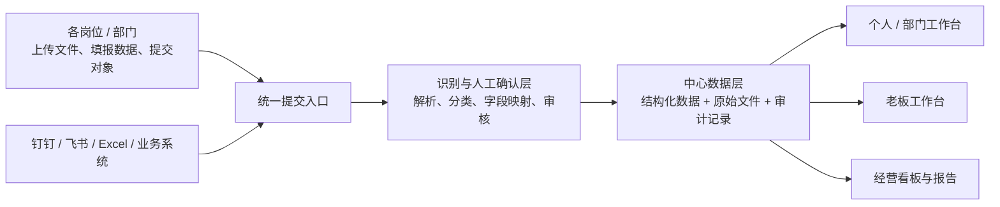
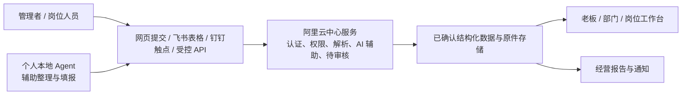
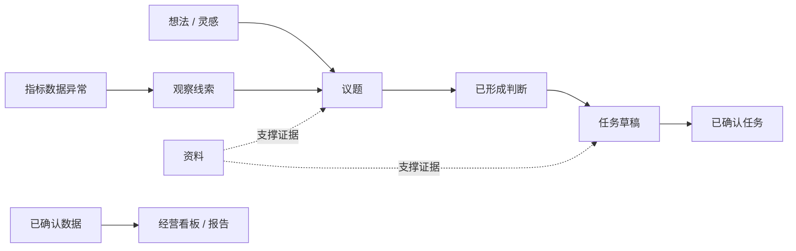
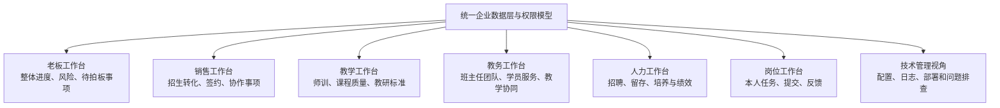
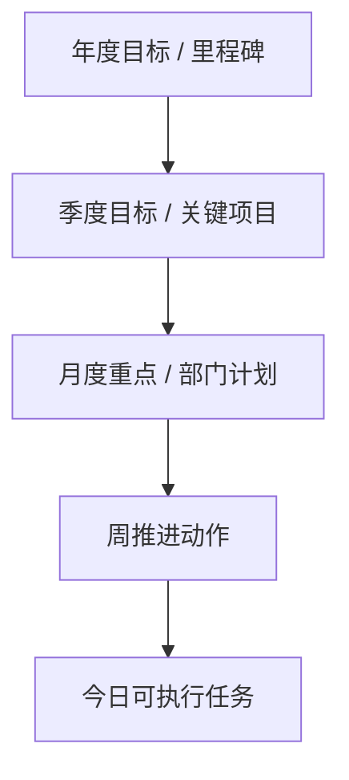
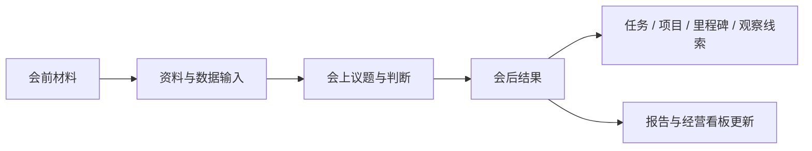

# 33 · 企业工作台产品结构与视频交互借鉴讨论整理 — 2026-05-24

## 一、本文定位

本文整理工作台只读试验之后，Frank 与 Codex 围绕企业工作台产品形态展开的两轮讨论：

1. 工作台若承载数据看板、内容创建、部门联动和层级操作，应如何理解其产品与技术边界。
2. 重新参考外部 Obsidian / agent 工作台视频后，哪些操作逻辑、布局结构和入口机制值得迁移到企业场景。

本文是**讨论整理和后续决策输入**，不是新增功能的正式立项或立即执行范围。

文档关系如下：

| 文档 | 关系 |
|---|---|
| `17-项目原始诉求与终局基线-V1-2026-05-18.md` | 冻结版终局目标，本文不修改 |
| `29-外部工作台与半路改造讨论整理-2026-05-24.md` | 第一轮外部案例、路线转向和技术支撑讨论记录 |
| `30-管理工作台与钉钉通道化路线校准-2026-05-24.md` | 当前已经拍板的正式路线结论，仍为执行口径 |
| `31-管理工作台V0验收清单-2026-05-24.md` | 当前只读试验验收依据 |
| `32-工作台权限身份与待确认操作路线-2026-05-24.md` | 工作台开放写入前的身份、权限和审计约束 |

本文提出的统一首页、创建入口、数据提交、部门视角、报告产出等内容，均需后续继续商讨并单独形成正式路线或 PR 后方可实施。

2026-05-25 补充讨论进一步提出：

1. 管理看板不能只看日 / 周，还应研究月度、季度和年度推进层级。
2. 阿里云中心平台、钉钉 / 飞书数据入口、服务端 AI 与个人 Agent 之间的职责需要明确。
3. 专属工作台候选范围需补充“教务”，并与“教学”职能严格区分。
4. 正式做数据看板前，应先征集管理岗位现有数据与职责，研究用飞书多维表格和 AI 录入降低维护成本。

## 二、当前验证基础

截至本轮讨论前，工作台试验已经揭示以下事实：

1. 钉钉复杂任务卡不适合作为管理主界面，工作台集中展示的信息更完整、更便于横向观察。
2. 任务详情需要压缩为真人判断所需的信息，不能把全部技术字段平铺给业务使用者。
3. 原有历史试验草稿不足以验证真实业务价值。
4. 5 月月会人工 Gold Set 能提供真实业务内容，但 32 条样本中没有一条满足 `What + Who + When` 的组织级任务。
5. 因此，真实月会内容应作为“判断材料”展示，而不是被强行导入任务池。

上述验证带来一个产品层面的新问题：

> 企业工作台未来不应只展示任务，也需要容纳经营数据、议题、观察线索、资料和报告；但这些对象不能被混同为任务，也不能未经权限和审核直接进入正式经营结论。

## 三、第一轮讨论：企业工作台需要承载哪些能力

### 3.1 Frank 提出的四组问题

Frank 提出，若工作台真正面向企业小团体，而非仅作为当前任务验证页，需要继续讨论四类能力。

#### 3.1.1 数据看板与数据录入

企业数据分散在各岗位、各管理者电脑里。若要在工作台呈现数据看板，需要明确：

1. 是否提供文件上传或数据提交入口。
2. 数据是否集中到阿里云服务器处理和保存。
3. 上传内容如何识别、解析和确认。
4. 数据最终归属于哪个部门、周期、指标和看板。
5. 飞书多维表格、钉钉、Excel 上传等渠道在其中扮演什么角色。

#### 3.1.2 任务、想法和灵感的创建

工作台不仅可能查看任务，也可能需要快速创建：

1. 任务。
2. 待讨论议题。
3. 想法 / 灵感。
4. 观察线索。
5. 资料或数据提交。

问题在于：这些入口是否开放、何时开放，以及是否能防止“所有输入都被包装为任务”。

#### 3.1.3 部门 / 岗位专属工作台与联动

企业工作台可能不只有老板首页，也需要：

1. 部门负责人管理本部门事项和数据。
2. 岗位使用者处理与自己相关的任务和提交。
3. 老板从全局视角下钻到各部门进度、风险和需要判断的问题。
4. 部门间在授权范围内传递协作数据和任务。

#### 3.1.4 卡片、板块和按钮的层级操作

工作台不应只是静态大屏。需要讨论：

1. 首页卡片是否可以点开列表。
2. 列表是否可以点进详情和原始材料。
3. 详情中是否可以进一步执行创建、分类、提交、审核或状态动作。
4. 哪些交互可以先做只读，哪些必须在权限和审计具备后才能开放。

### 3.2 对数据看板的初步理解：集中平台，而非个人数据库拼接

如果正式经营数据仍分散在个人电脑或每个部门各自维护的数据库中，会直接出现：

1. 指标口径不一致。
2. 数据版本无法确认。
3. 人员变化导致资料断裂。
4. 跨部门联动依赖传文件和人工解释。
5. 权限、审计和历史追溯难以统一。

因此，较可靠的目标结构应是：



初步建议是：

| 能力 | 初步定位 |
|---|---|
| PostgreSQL | 保存任务、指标结果、组织归属、审核状态、权限关系和审计记录 |
| 阿里云文件存储 / OSS | 保存上传的 Excel、Word、会议材料、原始报表等原件 |
| 网页工作台 | 成为正式交互入口和展示层 |
| 钉钉 | 保留登录候选和通知触达能力，不恢复复杂卡片主界面 |
| 飞书多维表格 | 可作为部分人工填报或协作数据输入端，不直接替代中心数据层 |
| Obsidian / Markdown | 可作为后续知识资料组织和检索参考，不作为经营主数据前提 |

这里需要进一步澄清：

> 阿里云不是单纯的“数据存储空间”，而应是企业平台的受控中心服务层。它同时承载数据存储、文件保管、身份权限、审核审计、API、受控 AI 处理以及向各类工作台供数的能力。

钉钉和飞书也不一定是所有数据都必须经过的中转站。它们可以分别承担：

| 通道 | 候选角色 |
|---|---|
| 网页工作台上传 / 填报 | 正式平台最直接的数据提交入口 |
| 飞书多维表格 | 适合字段已固定、多人持续维护的业务数据输入和协作表 |
| 钉钉 | 已有人员身份和通知触达通道，可承载简洁提交提醒或跳转 |
| 本地 Agent | 帮助个人整理、结构化、准备提交内容；提交时仍须经过企业身份和权限校验 |

因此，较准确的数据链路候选是：



无论内容由人工填报还是本地 Agent 协助生成，都不得绕过中心服务的身份、权限、审核和审计边界，直接改写正式看板结论。

### 3.3 数据提交不能等于直接进入看板

若后续开放数据上传，系统不能把上传文件内的内容直接认定为正式经营数据。最少需要经历：

1. 上传者身份识别。
2. 文件来源、部门和统计周期登记。
3. 字段解析与指标映射。
4. 异常或无法识别内容提示。
5. 有权限人员人工确认。
6. 确认后的结果才进入正式看板和报告。
7. 保留原始文件、确认人、时间和变更记录。

例如，Helen 提交一份销售月度数据，系统应先展示：

| 字段 | 示例 |
|---|---|
| 上传来源 | Helen 提交的销售报表 |
| 所属业务 | 励步 / 销售 |
| 统计期间 | 2026 年 5 月 |
| 识别指标 | 成交数、试听数、转化率等 |
| 当前状态 | 待确认 / 已确认 / 被退回 |
| 展示范围 | 部门视角 / 老板汇总视角 |

### 3.3.1 数据模板征集与飞书多维表格候选路线

Frank 提出，在设计数据看板前，应先从真实管理工作入手征集数据模板和工作项目。该路径比先凭空设计指标库更可靠。

第一轮征集可覆盖：

1. 各管理岗位目前正在填写、维护和提交哪些表格或数据。
2. 每张表的使用目的、维护频率、填报人、审核人和实际查看人。
3. 数据中哪些字段是长期稳定口径，哪些仍依赖人工解释。
4. 哪些数据涉及薪资、人事、绩效或敏感经营权限。
5. 各岗位日常工作内容、阶段任务、例会产出和需要维护的项目清单。

征集后的评估目标是：

| 评估问题 | 可能结论 |
|---|---|
| 字段固定、需要多人协作维护的数据 | 优先研究转换为飞书多维表格模板 |
| 格式混乱或口径未定的数据 | 先梳理定义和审核规则，不急于上表 |
| 原件价值高的报表或资料 | 保留文件原件，再抽取结构化结果 |
| 高敏感数据 | 单独设计访问权限和审计，不默认进入通用看板 |

飞书多维表格的潜在价值是减少原有人工 Excel 流转的安全和管理成本，并固定数据格式；但它是否成为正式输入渠道，还需要验证权限能力、接口同步、历史版本、备份和与中心数据库的关系。

### 3.3.2 AI 辅助录入的候选方向

Frank 希望推动管理层实际使用 AI，包括通过口述等低负担方式录入数据，再同步到飞书或中心平台。

该方向值得验证，但需要区分两个阶段：

| 阶段 | AI 可以做什么 | 仍由人负责什么 |
|---|---|---|
| 录入辅助 | 把口述、文字或文件整理为候选字段，提示遗漏和格式问题 | 确认内容真实、归属正确、是否提交 |
| 管理分析 | 汇总已确认数据，生成异常提示或报告草稿 | 确认经营结论、任务决策和正式发布 |

可候选验证的流程是：


AI 降低的是录入与整理成本，而不是取消数据责任和审核责任。

### 3.4 业务对象必须拆开管理

月会样本已经证明，企业信息不能全部进入任务池。后续工作台至少需要区分：

| 对象 | 定义 | 可能的后续流转 |
|---|---|---|
| 任务 | 已明确要执行，最终需具备责任和时间边界的事项 | 草稿 → 确认 → 执行 → 完成 / 取消 |
| 议题 | 需要进一步讨论、判断或拍板的问题 | 提交 → 研判 → 形成决策或任务 |
| 想法 / 灵感 | 尚未成熟但值得保存的设想 | 记录 → 回看 → 升级为议题或归档 |
| 观察线索 | 数据异常、风险、机会或经营苗头 | 记录 → 验证 → 升级为议题或关闭 |
| 资料 | 支撑判断的原始文件或内容 | 上传 → 分类 → 关联对象 |
| 指标数据 | 可进入经营看板的结构化事实 | 提交 → 解析 → 审核 → 展示 / 报告 |
| 报告 | 基于已确认事实和状态形成的阶段输出 | 草稿 → 审阅 → 发布 |

对象之间可以发生升级关系，但不能无门槛转换：



### 3.5 专属工作台应共享中心数据，而非各管一套数据库

部门和岗位可以拥有专属工作台视角，但不宜各自维护相互孤立的数据层。推荐模型是：



上述页面目前是**候选角色视角结构**，不是已经全部开发完成的正式页面。

其中“教学”和“教务”必须分别建模，不能被同一部门页混写：

| 专属工作台 | 主要职责边界 | 可能关注内容 |
|---|---|---|
| 教学 | 教师培训、课程质量、教研标准、课堂能力提升 | 过课、听课质量、教师培养、课程质量预警 |
| 教务 | 班主任团队、学员服务、教学老师的服务支持和执行衔接 | 班级服务、续费协同、家校沟通、学员问题处理、与教师协作事项 |

同一条对象在不同视角下可呈现不同粒度：

| 对象 | 老板视角 | 部门负责人视角 | 岗位使用者视角 |
|---|---|---|---|
| 部门数据 | 趋势、异常、待判断问题 | 本部门指标明细与提交状态 | 仅看授权填报或相关结果 |
| 跨部门任务 | 总体进度和阻塞 | 本部门承接和协作部分 | 自己负责或参与部分 |
| 风险线索 | 重大风险摘要 | 本部门线索及处理进展 | 被分配核实的内容 |
| 资料 | 依据权限下钻 | 本部门材料 | 自己提交或授权材料 |

需要后续明确的权限维度包括：

1. 内部人员身份 `internal_user_id`。
2. 外部平台登录映射，如钉钉 ID、飞书 ID。
3. 角色，如老板、业务负责人、任务负责人、技术管理员。
4. 组织范围，如业务线、部门和岗位。
5. 对象权限，如查看、创建、提交、审核、修改、导出。
6. 敏感资料边界，如薪资、绩效、人事和经营数据。

### 3.6 看板时间维度与任务层级需要拉开

Frank 提出，老板和管理者不能只看到日 / 周看板，还需要覆盖：

1. 当日任务。
2. 月度任务。
3. 季度任务。
4. 年度任务。

这个需求成立，但需要防止将所有长期目标粗略称为“任务”。较稳妥的建模方向是区分管理节奏与执行粒度：

| 时间维度 | 适合展示的对象 | 关键管理问题 |
|---|---|---|
| 今日 | 可立即执行的任务、临期和待判断事项 | 今天必须处理什么 |
| 本周 | 推进动作、阻塞和协作交付 | 本周如何推动结果 |
| 月度 | 月度重点事项、指标目标、部门计划和复盘结果 | 本月是否达成经营计划 |
| 季度 | 关键项目、阶段目标、组织建设动作和核心指标趋势 | 本季度战略推进是否偏航 |
| 年度 | 年度目标、业务线结果和重要里程碑 | 全年经营方向与目标达成 |

候选关系应是：



#### 3.6.1 后续建模核心表述：必须保留

Claude review 后，Frank 特别确认以下表述需要作为后续工作台建模与路线讨论的核心约束保留：

> 年度目标 / 里程碑 → 季度目标 / 关键项目 → 月度重点 / 部门计划 → 周推进动作 → 今日可执行任务。
>
> 这个层级的价值在于明确区分管理节奏和执行粒度：年度目标是方向，季度目标是阶段成果，月度重点是当期计划，周动作是推进手段，今日任务是可执行单元。

该表述的约束含义是：

1. 不能把年度目标仅仅建模为一个截止日期更远的 TDL。
2. 不能把季度项目、月度计划直接下发为提醒任务，而不先拆解成明确动作。
3. 今日任务可以归属到周动作、月度重点、季度项目和年度目标，从而实现从执行到经营目标的向上追踪。
4. 看板既要允许管理者向上看目标和成果，也要允许向下钻取具体负责人、任务、证据和阻塞。

后续看板需要支持向上查看目标、向下追踪动作，但并非每个年度或季度目标都直接进入 TDL 执行提醒链路。任务仍应遵守明确责任、时间和可执行边界；目标、指标和里程碑应拥有单独对象或关系字段。

#### 3.6.2 Claude review 提出的待补建模关系

Claude 指出，当前对象划分已覆盖任务、议题、想法、线索、资料、指标和报告，但在正式路线收口前仍应补充以下关系：

| 关系或对象 | 需要回答的问题 | 当前状态 |
|---|---|---|
| 项目对象 | 多个任务、议题和资料如何共同归属于一个季度关键项目 | 待设计 |
| 里程碑对象 | 阶段验收点如何独立于任务表示，并关联目标和证据 | 待设计 |
| 组成关系 | 年度目标如何包含季度项目，项目如何包含月度重点和任务 | 待设计 |
| 影响关系 | 一条任务或线索如何影响某项指标，指标如何支撑目标判断 | 待设计 |

这一缺口意味着，后续不能只在 TDL 表上增加更多时间字段来承载经营层级；应讨论目标、项目、里程碑、指标和任务之间的显式关联模型。

### 3.7 AI 所在层级与个人 Agent 对接边界

Frank 提出，AI 是否部署在阿里云服务器层进行数据处理和调用，以及管理者个人电脑上的 Claude / Codex / Agent 是否可以向企业平台提交已确定数据。

初步建议采用“中心受控 AI + 本地辅助 Agent”两层结构：

| 层级 | 可以承担的能力 | 不应直接拥有的能力 |
|---|---|---|
| 阿里云中心 AI 服务 | 文件解析、字段识别、分类候选、数据校验、权限范围内的检索、报告草稿生成 | 未经人工审核直接发布经营结论或批量生成正式任务 |
| 个人电脑 Agent | 个人口述整理、草稿形成、材料预处理、发起提交请求 | 绕过身份认证直接写正式数据、查看超权限资料、代表他人确认 |

个人 Agent 对接企业平台时，不建议先把数据“给到钉钉或飞书，再由它们进入阿里云”作为唯一链路。更可靠的结构是：

1. 企业平台提供受认证、可审计的数据提交接口。
2. 网页、飞书多维表格、钉钉触点和个人 Agent 均可成为获准的调用入口。
3. 任何入口提交的数据先进入待审核或草稿状态。
4. 由具有权限的人员核验后，才可进入正式看板、报告或任务流。
5. 每次提交保留提交人、提交通道、原始材料、AI 处理结果和审核记录。

该结构既允许不同管理者使用适合自己的 AI 工具提高效率，也避免个人 Agent 成为企业数据安全和口径失控的旁路。

#### 3.7.1 Agent 在阿里云上的准入门槛：可以做，但必须分两层

Frank 提问：个人电脑上的 Claude / Codex / Agent 若要向企业平台提交内容，能否在阿里云服务器层设置准入门槛。

初步结论是：

> 可以，而且必须设置准入门槛；但阿里云资源访问控制只能解决外层接入安全，不能替代企业业务层的权限、审核和审计。

候选的双层门槛如下：

| 门槛层级 | 负责拦截什么 | 候选机制 |
|---|---|---|
| 云资源 / API 外层门槛 | 未授权程序调用 API、读取或上传原件、暴露服务器资源 | API 网关 JWT / 消费者鉴权、RAM 最小权限、STS 临时授权、OSS 私有桶与授权策略、网络访问限制 |
| 企业业务内层门槛 | 某个已登录用户或 Agent 是否能提交某部门数据、查看某份敏感资料、审核或发布某个结论 | `internal_user_id`、角色与组织范围、对象权限、待审核状态、审批记录、操作审计 |

建议的 Agent 接入原则：

1. 不给个人 Agent 数据库账号，也不允许其直接连接 PostgreSQL。
2. 不给个人 Agent 长期、广泛的 OSS 写入密钥；如需上传原件，使用受范围和时效约束的临时授权或经后端代理上传。
3. Agent 只能调用明确开放的提交 API，初期仅允许创建待审核记录或草稿。
4. Agent 的凭据必须可以撤销、轮换、限制调用范围，并区分“人工登录操作”和“Agent 代提交”。
5. 提交记录需包含用户身份、Agent / 渠道标识、请求范围、原始材料或原件引用、AI 处理结果、审核结果和时间。
6. AI 在本地进行过预处理时，应要求随提交携带原始材料或声明 AI 整理过程，避免审计链只留下加工后的结果。
7. Agent 默认不能调用审核、正式发布、正式任务确认或敏感数据导出接口。

针对当前项目阶段，实施不应一步到位部署复杂云产品组合。可以分阶段理解：

| 阶段 | 准入做法 |
|---|---|
| 本机 / 小范围原型 | 不开放外部 Agent 写入，只讨论接口和权限模型 |
| 首个受控提交试点 | 现有 ECS 后端实现应用层认证、范围校验、待审核状态和审计记录；仅向特定用户开放 |
| 多管理者或 Agent 正式接入 | 再评估 API 网关鉴权、短期凭证、OSS 私有文件上传、调用限流与监控 |

与该候选方向相关的阿里云官方能力参考：

1. [访问控制 RAM](https://help.aliyun.com/zh/ram/)：管理用户、角色和云资源最小权限。
2. [企业使用 RAM 安全上云](https://help.aliyun.com/zh/ram/use-cases/ensure-security-of-alibaba-cloud-resources)：包括避免根用户、AccessKey 治理、MFA 和来源约束等安全实践。
3. [云原生 API 网关消费者认证鉴权](https://help.aliyun.com/zh/api-gateway/cloud-native-api-gateway/user-guide/configure-consumer-authentication)：支持通过认证与路由 / API 授权限制请求访问。
4. [API 网关 JWT 认证插件](https://help.aliyun.com/zh/api-gateway/traditional-api-gateway/user-guide/jwt-authentication)：可在网关校验 JWT，并将 claims 转给后端使用。
5. [OSS 权限与访问控制](https://help.aliyun.com/zh/oss/permission-and-access-control/)：用于原始文件私有保存和授权访问。

### 3.8 层级操作应按风险分阶段开放

卡片、板块和按钮可以设计成可展开、可操作，但必须区分阅读交互与写入动作：

| 动作 | 产品价值 | 写入风险 | 初步判断 |
|---|---|---:|---|
| 点击状态卡筛选列表 | 快速定位事项 | 无 | 可优先验证 |
| 点击列表查看详情 | 理解上下文 | 无 | 当前已局部实现 |
| 查看关联资料和来源 | 回溯判断依据 | 无 | 可作为近期候选 |
| 搜索 / 切换个人、部门、公司范围 | 提高查看效率 | 无，但涉及可见范围 | 需与权限设计结合 |
| 创建想法 / 线索 | 降低信息遗漏 | 低 | 登录、审计具备后可优先开放 |
| 提交议题 | 形成管理判断入口 | 中低 | 登录、审计具备后候选 |
| 提交数据文件 | 支撑看板 | 中 | 必须有归属、确认和版本记录 |
| 忽略 / 拒绝任务草稿并记录理由 | 清理待确认池 | 中 | `32` 文档建议的首个任务写入动作 |
| 确认任务 | 启动执行、提醒和责任链路 | 高 | 后置 |
| 删除数据或修改正式指标 | 改变经营依据 | 高 | 仅允许审计充分的受控操作 |

## 四、第二轮讨论：重新理解外部视频的操作结构

### 4.1 参考材料与参考边界

本轮重新查看的视频材料为：

`/Users/frankj/Downloads/ScreenRecording_05-24-2026 08-45-15_1.MP4`

视频展示的是一个以 Obsidian 和 agent 为基础的个人首页工作台。其业务内容属于内容创作者，但它的操作形态对企业管理工作台有参考价值。

参考时应坚持：

1. 学习首页组织方式和交互逻辑，不照搬创作者的业务模块。
2. 不把 Obsidian 当作企业工作台的必要底座。
3. 不因视频中 agent 可直接执行而默认授予企业系统自动执行权。
4. 用企业管理对象替换“选题、内容发布、阅读”等个人内容对象。

### 4.2 视频中观察到的操作结构

从视频页面和操作过程可以看到以下结构：

| 观察到的机制 | 视频中的表现 |
|---|---|
| 顶部状态计数 | 已创建 / 今日日志、今日待办、本周待办、逾期、进行中等醒目计数 |
| 快捷创建区 | 任务、想法、选题、灵感、日志等入口集中排列 |
| 标准流程 / skills 区 | 每日开场、任务管理、笔记分诊、收件箱归档、选题规划、资料打磨、视频数据分析等固定动作 |
| 一级 tab | 行动指北、内容创作、数据分析、稍后阅读 |
| 首页多面板 | 今日要事、本周计划、逾期 / 临期 / 活跃任务、流程进度等并列呈现 |
| 创建弹窗 | 点击创建任务后出现简洁录入弹窗，输入后保存到对应组织位置 |
| 流程指令触发 | 点击“每日开场”等入口后，指令进入终端 / agent 执行流程 |
| 内容与资料入口 | 内容创作区展示选题池、资料入口和进行中列表 |
| 数据分析区 | 通过指标卡、发布列表和 AI 分析建议呈现分析结果 |
| 稍后阅读区 | 将收集但尚未处理的内容单独组织为待阅读列表 |

视频的核心交互价值并不是某一张卡片，而是：

> 一个首页同时提供“现在发生了什么”“我现在要处理什么”“我可以立即创建或启动什么流程”。

### 4.3 可迁移到企业工作台的布局逻辑

#### 4.3.1 顶部状态条

企业版可以借鉴顶部状态条，让管理者第一眼先看到节奏和风险：

| 视频表达 | 企业工作台候选表达 |
|---|---|
| 今日待办 | 今日需处理 |
| 本周待办 | 本周推进 |
| 视频未重点覆盖的长周期管理 | 月度重点 / 季度项目 / 年度里程碑需在企业版补入 |
| 逾期 | 逾期 / 临期 |
| 进行中 | 推进中 |
| 已创建 / 日志 | 待确认 / 待判断 |
| 内容数据异常 | 数据异常 / 待审核 |

候选交互：

1. 状态卡可点击后过滤当前 tab 的列表。
2. 点击数量应能看到明细和来源，不能只有数字。
3. “我的 / 部门 / 公司”视角切换需与权限边界绑定。

#### 4.3.2 快捷创建区

视频把高频录入动作固定在首页顶部，这一点值得迁移。企业版候选入口为：

| 快捷入口 | 对象归属 | 初步开放判断 |
|---|---|---|
| 新建任务 | 任务草稿池 | 需身份、权限、审计和确认链路 |
| 提交议题 | 议题池 | 可作为低风险写入候选 |
| 记录想法 | 火花池 | 可作为低风险写入候选 |
| 记录线索 | 观察池 | 可作为低风险写入候选 |
| 提交数据 | 数据待审核池 | 需先确定首个真实数据场景 |
| 上传资料 | 资料待归档区 | 需来源、权限、关联和原件保存规则 |

关键约束：

> 首页可以把不同对象的录入入口做得同样便捷，但系统必须把它们保存为不同对象，不能默认都创建 TDL。

#### 4.3.3 标准流程入口

视频中的 skills 不是内容卡片，而是把重复动作固化为一键启动流程。企业版可以候选设计为：

| 流程入口 | 预期作用 | 初期边界 |
|---|---|---|
| 今日管理启动 | 汇总今日任务、风险、待判断和异常数据 | 先只读汇总 |
| 周例会准备 | 汇总本周进展、卡点、议题 | 先生成草稿 |
| 会议材料复核 | 复核识别出的事实、议题、线索与任务候选 | 当前月会判断视图可作为基础 |
| 数据提交审核 | 查看部门提交的数据及解析结果 | 后续数据试点后进入 |
| 月度经营复盘 | 汇总指标、任务、风险和报告草稿 | 后续候选 |
| 报告生成 | 形成日报 / 周报 / 月报草稿 | 不自动发布 |

与个人工作台不同，企业版不能默认让流程按钮直接改变任务状态、发布经营结论或发送通知。初期 agent 只可辅助汇总和生成待审草稿。

#### 4.3.4 一级 tab 与面板布局

视频采用 tab 切换主要工作域，而不是把所有模块都堆在首页。结合本项目诉求，候选一级结构为：

| 企业版 tab | 承载内容 | 当前已有基础 |
|---|---|---|
| 行动与目标 | 今日、本周、月度重点、季度项目、年度里程碑、逾期 / 临期、待确认 | 当前任务工作台只读页面只覆盖近期部分 |
| 经营数据 | 指标、数据提交状态、异常和部门对比 | 尚需首个数据提交试点 |
| 议题与线索 | 会议判断、待处理议题、观察线索、想法 | 当前 5 月月会判断样本页面 |
| 资料与报告 | 原始资料、会议材料、归档、报告草稿 | 尚需资料索引和报告设计 |

当前已有的“任务工作台”和“5 月月会判断样本”可以视作上述 tab 的验证数据基础，而不必长期作为彼此割裂的独立产品入口。

### 4.4 不应迁移的内容与风险

| 视频机制或业务内容 | 不直接迁移的原因 | 企业版处理 |
|---|---|---|
| 选题、发布笔记、热点雷达、播放数据 | 属于内容创作业务，不对应当前企业管理对象 | 用议题、指标、风险和报告替换 |
| 个人点击后即执行 agent 指令 | 企业动作涉及责任、权限和经营结论 | 初期只汇总或生成草稿，最终动作由人确认 |
| 文件直接按个人习惯归档 | 企业材料涉及权限、版本和审计 | 中心化保存，保留来源与访问控制 |
| CSS / 插件驱动首页建设 | 是实现方式，不是产品能力 | 前端实现服务于正式数据和权限模型 |
| 本地 Obsidian 作为全局数据中心 | 不适合多人协作和正式经营数据 | 可作为知识整理补充，不作为主数据层 |

## 五、候选统一首页结构

基于第一轮企业诉求和第二轮视频借鉴，工作台后续可讨论的统一首页骨架如下：

```text
┌────────────────────────────────────────────────────────────────────┐
│ 企业工作台                    我的 / 部门 / 公司       身份与权限范围 │
├────────────────────────────────────────────────────────────────────┤
│ 今日需处理 │ 本周推进 │ 月度重点 │ 季度项目 │ 逾期临期 │ 待判断       │
│ 年度里程碑 │ 数据异常 │ 报告待审 │                                             │
├────────────────────────────────────────────────────────────────────┤
│ +任务  +议题  +想法  +线索  +提交数据  +上传资料                    │
│ 今日启动   会议复核   数据审核   周例会准备   月报生成              │
├────────────────────────────────────────────────────────────────────┤
│ 行动与目标        经营数据          议题与线索          资料与报告   │
├───────────────────────────────────┬────────────────────────────────┤
│ 当前 tab 的列表、看板和筛选         │ 选中项详情、依据、关联与允许动作 │
│                                   │                                │
└───────────────────────────────────┴────────────────────────────────┘
```

这个骨架借鉴视频中的：

1. 状态总览。
2. 高频创建。
3. 固定流程启动。
4. 一级 tab。
5. 点击列表后右侧详情。

同时补入企业系统必须具备但个人工作台未充分强调的：

1. 组织视角切换。
2. 权限范围显示。
3. 数据提交与审核状态。
4. 对象分类和任务准入边界。
5. 报告审阅与正式输出边界。
6. 日 / 周 / 月 / 季 / 年不同管理节奏之间的下钻关系。

## 六、当前可接受的共识与仍待拍板内容

### 6.1 本轮可以作为后续讨论基础的认识

本轮已形成较强认同、但仍需在正式路线文档中确认的认识包括：

1. 企业工作台不应仅等于任务页，应能够承载任务之外的议题、线索、资料和数据视角。
2. 数据看板必须建立在集中数据、来源标记和确认机制之上，不能简单汇聚个人电脑文件。
3. 不同部门和岗位可有专属视角，但应共享统一中心数据与权限模型。
4. 视频中的顶部状态、快捷创建、标准流程和 tab 布局值得迁移。
5. 创建任务、想法、议题和线索的交互可以同样便利，但数据对象和风险级别必须分开。
6. 当前只读页面是验证基础，后续不应只是不断追加孤立页面，而应讨论统一首页结构。
7. 管理节奏需要覆盖日、周、月、季、年，但长期目标和里程碑不能未经拆解直接当成执行任务。
8. 阿里云应被理解为中心化受控平台，个人 Agent 和外部入口均只能在身份、权限、审核与审计约束下提交内容。
9. 专属视角需区分销售、教学、教务、人力和技术；其中教务与教学职责不同。
10. 设计数据看板前应先征集管理岗位既有表格和职责项目，评估可否转换成飞书多维表格及 AI 辅助录入方式。

### 6.2 尚未拍板、不能视为开发承诺的事项

| 待决策问题 | 需要继续确认的核心内容 |
|---|---|
| 首个经营数据看板 | 选销售经营、招生转化、教学质量、人力还是其他场景 |
| 数据录入方式 | 上传 Excel、网页表单、飞书多维表格同步或组合方式 |
| 岗位资料征集范围 | 先征集哪些管理岗位、哪些现有表格和职责项目，如何标注敏感性 |
| 飞书模板化路径 | 哪些现有人工表格适合改造成多维表格，正式主数据落在哪里 |
| AI 辅助录入 | 口述录入如何校验、提交、审核和保留原始证据 |
| 正式文件存储 | 服务器目录还是阿里云 OSS，版本和备份规则是什么 |
| 身份入口 | 钉钉 OAuth 优先是否正式确定，飞书如何后续绑定 |
| 中心 AI 与本地 Agent | 哪些处理在阿里云发生，本地 Agent 以何种认证接口提交，如何审计 |
| 权限模型 | 哪些部门、岗位、敏感数据的可见与操作范围 |
| 首页一级 tab | 四个 tab 是否符合 Frank 和 Helen 的日常使用习惯 |
| 时间层级模型 | 年度目标、季度项目、月度重点、周动作和今日任务如何关联 |
| 专属工作台范围 | 销售、教学、教务、人力、技术和其他岗位分别需哪些卡片 |
| 快捷创建优先级 | 先开放想法 / 线索 / 议题，还是先完成任务草稿操作 |
| 流程按钮边界 | agent 可生成哪些汇总草稿，哪些动作永远需人工确认 |
| 报告产出 | 日报、周报、月报先做哪个，事实、判断、建议如何区分 |
| 跨部门联动 | 共享对象、转交、协作、升级和审批如何表达 |

### 6.3 并行推进中的月度会议结构化优化

Frank 同步说明，另一个分支方向正在讨论月度会议的调整方案，目标是建立更结构化的会议模式，拟优化：

1. 开会节奏与会议结构。
2. 会前预看的准备材料。
3. 会上要讨论的内容。
4. 会后必须达成的结果。

该工作目前尚在商讨中，待流程打通后再补充详细方案。本工作台文档当前只记录其与平台设计的潜在衔接价值，不提前假设其最终模板或系统实现。

未来可能的衔接关系是：



后续需要特别检查：

1. 会前材料是否可以成为资料与指标数据的标准入口。
2. 会上讨论是否能明确区分事实、议题、判断和待执行事项。
3. 会后结果是否能可靠产生项目、里程碑或满足准入要求的任务，而不是重复制造伪任务。
4. 月度会议模板是否能成为月度看板和报告产出的真实业务依据。

## 七、建议的后续商讨和推进顺序

为避免在方向成立后再次出现范围膨胀，建议按照“先定结构，再选闭环，再做写入”的顺序继续。

### 阶段 A：统一首页信息架构原型

目标：

1. 用视频借鉴的布局，形成状态条、快捷入口、流程入口、tab 和详情区的可视原型。
2. 把现有任务数据与月会判断样本放入对应 tab。
3. 快捷创建和流程按钮可先展示候选位置或做无写入交互，不直接开放正式操作。
4. 让 Frank 和 Helen 判断这个操作骨架是否符合每天真实使用方式。
5. 在视觉原型中表达日 / 周 / 月 / 季 / 年层级及销售、教学、教务等视角入口，但不虚构真实数据能力。

本阶段回答：

> 工作台首页应该如何组织，管理者才愿意持续打开和使用？

### 阶段 B：对象、数据和权限设计收口

目标：

1. 确认任务、议题、想法、线索、资料、指标和报告的最小对象模型。
2. 确认个人、部门、公司视角的权限规则。
3. 确认身份认证和平台 ID 映射方式。
4. 选择首个数据看板场景以及数据录入方式。
5. 明确目标、里程碑、指标和任务之间的时间层级关系。
6. 形成管理岗位现有数据模板与职责项目的征集表。
7. 明确阿里云中心 AI、本地 Agent 和飞书 / 钉钉入口的提交与审核边界。

本阶段回答：

> 哪些内容可以写入系统，由谁写、谁看、谁确认？

### 阶段 C：开放一个低风险写入闭环

候选优先级：

1. 创建议题或观察线索。
2. 忽略 / 拒绝现有任务草稿并填写理由。
3. 创建想法 / 灵感。

不建议一开始开放：

1. 正式任务确认。
2. 自动发提醒。
3. 正式指标修改。
4. 自动生成并发布报告。

本阶段回答：

> 工作台是否不仅可看，而且能够可靠接收第一类真实管理输入？

### 阶段 D：首个数据提交与看板试点

建议在完成岗位数据与模板征集后，只选择一个业务范围清晰、Helen 能直接判断质量的真实场景，例如销售经营月度看板或招生转化看板。

需验证：

1. 上传或填报入口。
2. 指标识别与人工确认。
3. 数据归属与权限隔离。
4. 部门视角与老板视角的不同呈现。
5. 原件、变更记录和报告引用的可追溯性。
6. 是否值得将对应人工表格转换为飞书多维表格，并通过 AI 降低填报负担。

### 阶段 E：跨部门联动、通知和报告输出

在前述基础稳定后，再讨论：

1. 钉钉通知跳转工作台。
2. 跨部门任务与议题协作。
3. 周报 / 月报草稿生成与审批。
4. agent 辅助汇总和流程自动化。
5. 飞书多维表格或 Obsidian 在知识与人工维护场景中的补位。

## 八、下一轮讨论建议聚焦的问题

为把大方向继续收敛为可实施方案，下一轮建议依次回答：

1. 统一首页四个 tab 是否正确，尤其“行动与目标”是否能承接日 / 周 / 月 / 季 / 年视角。
2. 顶部状态卡中，管理者最需要第一眼看到哪些数字，月度、季度和年度信息应放在首页还是下钻页。
3. 快捷创建入口中，第一批真实需要的是任务、议题、想法、线索还是数据提交。
4. Helen 最适合作为首个数据看板试点判断者的真实数据场景是什么。
5. 销售、教学、教务、人力、技术等专属视角分别需要收集哪些现有数据模板和职责项目。
6. 阿里云中心服务、飞书多维表格、钉钉触点和个人 Agent 之间的正式提交链路应如何定。
7. Frank、Helen 以及未来部门负责人分别应该看到哪些范围和动作。
8. 页面可以先呈现哪些按钮位置作为产品原型，哪些按钮在未具备权限与审计前必须完全不出现。

## 九、Claude Review 后的新增确认与保留问题

本轮提交 Claude review 后，以下内容获得较明确支持，可作为后续正式路线校准的重点输入：

1. 日 / 周 / 月 / 季 / 年的管理层级设计合理，但不得把目标和里程碑直接做成长截止日期任务。
2. 任务、议题、想法、线索、资料、指标、报告的对象拆分方向成立。
3. 教学与教务应作为职责不同的专属工作台候选视角。
4. 数据看板应先征集管理岗位已有表格、维护数据与工作项目，再选择试点。
5. 阿里云应定位为中心受控平台，而不是单纯数据存储。
6. 统一首页骨架可以继续作为下一步可视化原型验证方向。

同时必须继续保留并补充的问题包括：

1. 项目、目标、里程碑、指标和任务之间的组成关系与影响关系。
2. 飞书多维表格与中心数据层之间的主数据权威策略。
3. 中心 AI 和个人 Agent 的凭证、scope、原始材料提交和审计方案。
4. 月度会议结构化优化完成后，如何作为工作台的资料、议题、任务和报告输入源。

## 十、本文当前结论

本轮讨论的阶段性结论是：

> 工作台已经不应继续被理解为单一任务列表。它更接近一个面向企业管理者的统一操作台：既展示从今日任务到年度里程碑的管理节奏，也展示数据、议题和资料，并提供受控的创建与流程入口。外部视频最值得借鉴的是其“状态总览 + 快捷创建 + 标准流程 + 分区 tab + 详情下钻”的交互结构；企业版必须在此基础上补充中心数据、部门与岗位视角、身份权限、审核审计、AI 提交边界和对象层级关系。

当前先记录并讨论该结构，不立即把数据上传、任务创建、跨部门联动或报告产出纳入已确认开发范围。后续应基于本文逐项定案，再形成正式路线校准与开发 PR。
