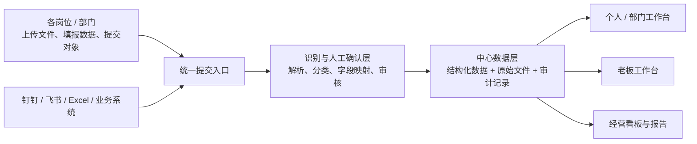
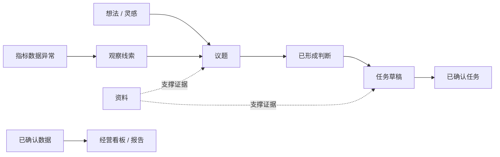
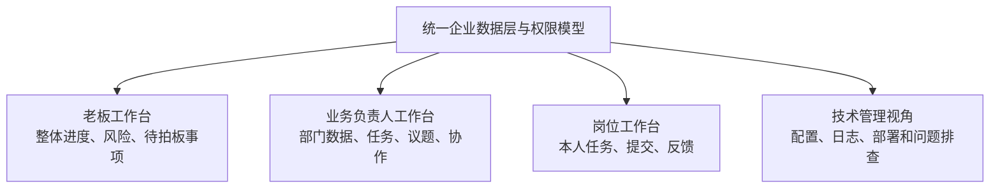

# 33 · 企业工作台产品结构与视频交互借鉴讨论整理 — 2026-05-24

## 一、本文定位

本文整理工作台只读试验之后，Frank 与 Codex 围绕企业工作台产品形态展开的两轮讨论：

1. 工作台若承载数据看板、内容创建、部门联动和层级操作，应如何理解其产品与技术边界。
2. 重新参考外部 Obsidian / agent 工作台视频后，哪些操作逻辑、布局结构和入口机制值得迁移到企业场景。

本文是**讨论整理和后续决策输入**，不是新增功能的正式立项或立即执行范围。

文档关系如下：

| 文档 | 关系 |
|---|---|
| `17-项目原始诉求与终局基线-V1-2026-05-18.md` | 冻结版终局目标，本文不修改 |
| `29-外部工作台与半路改造讨论整理-2026-05-24.md` | 第一轮外部案例、路线转向和技术支撑讨论记录 |
| `30-管理工作台与钉钉通道化路线校准-2026-05-24.md` | 当前已经拍板的正式路线结论，仍为执行口径 |
| `31-管理工作台V0验收清单-2026-05-24.md` | 当前只读试验验收依据 |
| `32-工作台权限身份与待确认操作路线-2026-05-24.md` | 工作台开放写入前的身份、权限和审计约束 |

本文提出的统一首页、创建入口、数据提交、部门视角、报告产出等内容，均需后续继续商讨并单独形成正式路线或 PR 后方可实施。

## 二、当前验证基础

截至本轮讨论前，工作台试验已经揭示以下事实：

1. 钉钉复杂任务卡不适合作为管理主界面，工作台集中展示的信息更完整、更便于横向观察。
2. 任务详情需要压缩为真人判断所需的信息，不能把全部技术字段平铺给业务使用者。
3. 原有历史试验草稿不足以验证真实业务价值。
4. 5 月月会人工 Gold Set 能提供真实业务内容，但 32 条样本中没有一条满足 `What + Who + When` 的组织级任务。
5. 因此，真实月会内容应作为“判断材料”展示，而不是被强行导入任务池。

上述验证带来一个产品层面的新问题：

> 企业工作台未来不应只展示任务，也需要容纳经营数据、议题、观察线索、资料和报告；但这些对象不能被混同为任务，也不能未经权限和审核直接进入正式经营结论。

## 三、第一轮讨论：企业工作台需要承载哪些能力

### 3.1 Frank 提出的四组问题

Frank 提出，若工作台真正面向企业小团体，而非仅作为当前任务验证页，需要继续讨论四类能力。

#### 3.1.1 数据看板与数据录入

企业数据分散在各岗位、各管理者电脑里。若要在工作台呈现数据看板，需要明确：

1. 是否提供文件上传或数据提交入口。
2. 数据是否集中到阿里云服务器处理和保存。
3. 上传内容如何识别、解析和确认。
4. 数据最终归属于哪个部门、周期、指标和看板。
5. 飞书多维表格、钉钉、Excel 上传等渠道在其中扮演什么角色。

#### 3.1.2 任务、想法和灵感的创建

工作台不仅可能查看任务，也可能需要快速创建：

1. 任务。
2. 待讨论议题。
3. 想法 / 灵感。
4. 观察线索。
5. 资料或数据提交。

问题在于：这些入口是否开放、何时开放，以及是否能防止“所有输入都被包装为任务”。

#### 3.1.3 部门 / 岗位专属工作台与联动

企业工作台可能不只有老板首页，也需要：

1. 部门负责人管理本部门事项和数据。
2. 岗位使用者处理与自己相关的任务和提交。
3. 老板从全局视角下钻到各部门进度、风险和需要判断的问题。
4. 部门间在授权范围内传递协作数据和任务。

#### 3.1.4 卡片、板块和按钮的层级操作

工作台不应只是静态大屏。需要讨论：

1. 首页卡片是否可以点开列表。
2. 列表是否可以点进详情和原始材料。
3. 详情中是否可以进一步执行创建、分类、提交、审核或状态动作。
4. 哪些交互可以先做只读，哪些必须在权限和审计具备后才能开放。

### 3.2 对数据看板的初步理解：集中平台，而非个人数据库拼接

如果正式经营数据仍分散在个人电脑或每个部门各自维护的数据库中，会直接出现：

1. 指标口径不一致。
2. 数据版本无法确认。
3. 人员变化导致资料断裂。
4. 跨部门联动依赖传文件和人工解释。
5. 权限、审计和历史追溯难以统一。

因此，较可靠的目标结构应是：



初步建议是：

| 能力 | 初步定位 |
|---|---|
| PostgreSQL | 保存任务、指标结果、组织归属、审核状态、权限关系和审计记录 |
| 阿里云文件存储 / OSS | 保存上传的 Excel、Word、会议材料、原始报表等原件 |
| 网页工作台 | 成为正式交互入口和展示层 |
| 钉钉 | 保留登录候选和通知触达能力，不恢复复杂卡片主界面 |
| 飞书多维表格 | 可作为部分人工填报或协作数据输入端，不直接替代中心数据层 |
| Obsidian / Markdown | 可作为后续知识资料组织和检索参考，不作为经营主数据前提 |

### 3.3 数据提交不能等于直接进入看板

若后续开放数据上传，系统不能把上传文件内的内容直接认定为正式经营数据。最少需要经历：

1. 上传者身份识别。
2. 文件来源、部门和统计周期登记。
3. 字段解析与指标映射。
4. 异常或无法识别内容提示。
5. 有权限人员人工确认。
6. 确认后的结果才进入正式看板和报告。
7. 保留原始文件、确认人、时间和变更记录。

例如，Helen 提交一份销售月度数据，系统应先展示：

| 字段 | 示例 |
|---|---|
| 上传来源 | Helen 提交的销售报表 |
| 所属业务 | 励步 / 销售 |
| 统计期间 | 2026 年 5 月 |
| 识别指标 | 成交数、试听数、转化率等 |
| 当前状态 | 待确认 / 已确认 / 被退回 |
| 展示范围 | 部门视角 / 老板汇总视角 |

### 3.4 业务对象必须拆开管理

月会样本已经证明，企业信息不能全部进入任务池。后续工作台至少需要区分：

| 对象 | 定义 | 可能的后续流转 |
|---|---|---|
| 任务 | 已明确要执行，最终需具备责任和时间边界的事项 | 草稿 → 确认 → 执行 → 完成 / 取消 |
| 议题 | 需要进一步讨论、判断或拍板的问题 | 提交 → 研判 → 形成决策或任务 |
| 想法 / 灵感 | 尚未成熟但值得保存的设想 | 记录 → 回看 → 升级为议题或归档 |
| 观察线索 | 数据异常、风险、机会或经营苗头 | 记录 → 验证 → 升级为议题或关闭 |
| 资料 | 支撑判断的原始文件或内容 | 上传 → 分类 → 关联对象 |
| 指标数据 | 可进入经营看板的结构化事实 | 提交 → 解析 → 审核 → 展示 / 报告 |
| 报告 | 基于已确认事实和状态形成的阶段输出 | 草稿 → 审阅 → 发布 |

对象之间可以发生升级关系，但不能无门槛转换：



### 3.5 专属工作台应共享中心数据，而非各管一套数据库

部门和岗位可以拥有专属工作台视角，但不宜各自维护相互孤立的数据层。推荐模型是：



同一条对象在不同视角下可呈现不同粒度：

| 对象 | 老板视角 | 部门负责人视角 | 岗位使用者视角 |
|---|---|---|---|
| 部门数据 | 趋势、异常、待判断问题 | 本部门指标明细与提交状态 | 仅看授权填报或相关结果 |
| 跨部门任务 | 总体进度和阻塞 | 本部门承接和协作部分 | 自己负责或参与部分 |
| 风险线索 | 重大风险摘要 | 本部门线索及处理进展 | 被分配核实的内容 |
| 资料 | 依据权限下钻 | 本部门材料 | 自己提交或授权材料 |

需要后续明确的权限维度包括：

1. 内部人员身份 `internal_user_id`。
2. 外部平台登录映射，如钉钉 ID、飞书 ID。
3. 角色，如老板、业务负责人、任务负责人、技术管理员。
4. 组织范围，如业务线、部门和岗位。
5. 对象权限，如查看、创建、提交、审核、修改、导出。
6. 敏感资料边界，如薪资、绩效、人事和经营数据。

### 3.6 层级操作应按风险分阶段开放

卡片、板块和按钮可以设计成可展开、可操作，但必须区分阅读交互与写入动作：

| 动作 | 产品价值 | 写入风险 | 初步判断 |
|---|---|---:|---|
| 点击状态卡筛选列表 | 快速定位事项 | 无 | 可优先验证 |
| 点击列表查看详情 | 理解上下文 | 无 | 当前已局部实现 |
| 查看关联资料和来源 | 回溯判断依据 | 无 | 可作为近期候选 |
| 搜索 / 切换个人、部门、公司范围 | 提高查看效率 | 无，但涉及可见范围 | 需与权限设计结合 |
| 创建想法 / 线索 | 降低信息遗漏 | 低 | 登录、审计具备后可优先开放 |
| 提交议题 | 形成管理判断入口 | 中低 | 登录、审计具备后候选 |
| 提交数据文件 | 支撑看板 | 中 | 必须有归属、确认和版本记录 |
| 忽略 / 拒绝任务草稿并记录理由 | 清理待确认池 | 中 | `32` 文档建议的首个任务写入动作 |
| 确认任务 | 启动执行、提醒和责任链路 | 高 | 后置 |
| 删除数据或修改正式指标 | 改变经营依据 | 高 | 仅允许审计充分的受控操作 |

## 四、第二轮讨论：重新理解外部视频的操作结构

### 4.1 参考材料与参考边界

本轮重新查看的视频材料为：

`/Users/frankj/Downloads/ScreenRecording_05-24-2026 08-45-15_1.MP4`

视频展示的是一个以 Obsidian 和 agent 为基础的个人首页工作台。其业务内容属于内容创作者，但它的操作形态对企业管理工作台有参考价值。

参考时应坚持：

1. 学习首页组织方式和交互逻辑，不照搬创作者的业务模块。
2. 不把 Obsidian 当作企业工作台的必要底座。
3. 不因视频中 agent 可直接执行而默认授予企业系统自动执行权。
4. 用企业管理对象替换“选题、内容发布、阅读”等个人内容对象。

### 4.2 视频中观察到的操作结构

从视频页面和操作过程可以看到以下结构：

| 观察到的机制 | 视频中的表现 |
|---|---|
| 顶部状态计数 | 已创建 / 今日日志、今日待办、本周待办、逾期、进行中等醒目计数 |
| 快捷创建区 | 任务、想法、选题、灵感、日志等入口集中排列 |
| 标准流程 / skills 区 | 每日开场、任务管理、笔记分诊、收件箱归档、选题规划、资料打磨、视频数据分析等固定动作 |
| 一级 tab | 行动指北、内容创作、数据分析、稍后阅读 |
| 首页多面板 | 今日要事、本周计划、逾期 / 临期 / 活跃任务、流程进度等并列呈现 |
| 创建弹窗 | 点击创建任务后出现简洁录入弹窗，输入后保存到对应组织位置 |
| 流程指令触发 | 点击“每日开场”等入口后，指令进入终端 / agent 执行流程 |
| 内容与资料入口 | 内容创作区展示选题池、资料入口和进行中列表 |
| 数据分析区 | 通过指标卡、发布列表和 AI 分析建议呈现分析结果 |
| 稍后阅读区 | 将收集但尚未处理的内容单独组织为待阅读列表 |

视频的核心交互价值并不是某一张卡片，而是：

> 一个首页同时提供“现在发生了什么”“我现在要处理什么”“我可以立即创建或启动什么流程”。

### 4.3 可迁移到企业工作台的布局逻辑

#### 4.3.1 顶部状态条

企业版可以借鉴顶部状态条，让管理者第一眼先看到节奏和风险：

| 视频表达 | 企业工作台候选表达 |
|---|---|
| 今日待办 | 今日需处理 |
| 本周待办 | 本周推进 |
| 逾期 | 逾期 / 临期 |
| 进行中 | 推进中 |
| 已创建 / 日志 | 待确认 / 待判断 |
| 内容数据异常 | 数据异常 / 待审核 |

候选交互：

1. 状态卡可点击后过滤当前 tab 的列表。
2. 点击数量应能看到明细和来源，不能只有数字。
3. “我的 / 部门 / 公司”视角切换需与权限边界绑定。

#### 4.3.2 快捷创建区

视频把高频录入动作固定在首页顶部，这一点值得迁移。企业版候选入口为：

| 快捷入口 | 对象归属 | 初步开放判断 |
|---|---|---|
| 新建任务 | 任务草稿池 | 需身份、权限、审计和确认链路 |
| 提交议题 | 议题池 | 可作为低风险写入候选 |
| 记录想法 | 火花池 | 可作为低风险写入候选 |
| 记录线索 | 观察池 | 可作为低风险写入候选 |
| 提交数据 | 数据待审核池 | 需先确定首个真实数据场景 |
| 上传资料 | 资料待归档区 | 需来源、权限、关联和原件保存规则 |

关键约束：

> 首页可以把不同对象的录入入口做得同样便捷，但系统必须把它们保存为不同对象，不能默认都创建 TDL。

#### 4.3.3 标准流程入口

视频中的 skills 不是内容卡片，而是把重复动作固化为一键启动流程。企业版可以候选设计为：

| 流程入口 | 预期作用 | 初期边界 |
|---|---|---|
| 今日管理启动 | 汇总今日任务、风险、待判断和异常数据 | 先只读汇总 |
| 周例会准备 | 汇总本周进展、卡点、议题 | 先生成草稿 |
| 会议材料复核 | 复核识别出的事实、议题、线索与任务候选 | 当前月会判断视图可作为基础 |
| 数据提交审核 | 查看部门提交的数据及解析结果 | 后续数据试点后进入 |
| 月度经营复盘 | 汇总指标、任务、风险和报告草稿 | 后续候选 |
| 报告生成 | 形成日报 / 周报 / 月报草稿 | 不自动发布 |

与个人工作台不同，企业版不能默认让流程按钮直接改变任务状态、发布经营结论或发送通知。初期 agent 只可辅助汇总和生成待审草稿。

#### 4.3.4 一级 tab 与面板布局

视频采用 tab 切换主要工作域，而不是把所有模块都堆在首页。结合本项目诉求，候选一级结构为：

| 企业版 tab | 承载内容 | 当前已有基础 |
|---|---|---|
| 今日行动 | 今日、本周、逾期 / 临期、进行中、待确认 | 当前任务工作台只读页面 |
| 经营数据 | 指标、数据提交状态、异常和部门对比 | 尚需首个数据提交试点 |
| 议题与线索 | 会议判断、待处理议题、观察线索、想法 | 当前 5 月月会判断样本页面 |
| 资料与报告 | 原始资料、会议材料、归档、报告草稿 | 尚需资料索引和报告设计 |

当前已有的“任务工作台”和“5 月月会判断样本”可以视作上述 tab 的验证数据基础，而不必长期作为彼此割裂的独立产品入口。

### 4.4 不应迁移的内容与风险

| 视频机制或业务内容 | 不直接迁移的原因 | 企业版处理 |
|---|---|---|
| 选题、发布笔记、热点雷达、播放数据 | 属于内容创作业务，不对应当前企业管理对象 | 用议题、指标、风险和报告替换 |
| 个人点击后即执行 agent 指令 | 企业动作涉及责任、权限和经营结论 | 初期只汇总或生成草稿，最终动作由人确认 |
| 文件直接按个人习惯归档 | 企业材料涉及权限、版本和审计 | 中心化保存，保留来源与访问控制 |
| CSS / 插件驱动首页建设 | 是实现方式，不是产品能力 | 前端实现服务于正式数据和权限模型 |
| 本地 Obsidian 作为全局数据中心 | 不适合多人协作和正式经营数据 | 可作为知识整理补充，不作为主数据层 |

## 五、候选统一首页结构

基于第一轮企业诉求和第二轮视频借鉴，工作台后续可讨论的统一首页骨架如下：

```text
┌────────────────────────────────────────────────────────────────────┐
│ 企业工作台                    我的 / 部门 / 公司       身份与权限范围 │
├────────────────────────────────────────────────────────────────────┤
│ 今日需处理 │ 本周推进 │ 逾期临期 │ 待判断 │ 数据异常 │ 报告待审       │
├────────────────────────────────────────────────────────────────────┤
│ +任务  +议题  +想法  +线索  +提交数据  +上传资料                    │
│ 今日启动   会议复核   数据审核   周例会准备   月报生成              │
├────────────────────────────────────────────────────────────────────┤
│ 今日行动          经营数据          议题与线索          资料与报告   │
├───────────────────────────────────┬────────────────────────────────┤
│ 当前 tab 的列表、看板和筛选         │ 选中项详情、依据、关联与允许动作 │
│                                   │                                │
└───────────────────────────────────┴────────────────────────────────┘
```

这个骨架借鉴视频中的：

1. 状态总览。
2. 高频创建。
3. 固定流程启动。
4. 一级 tab。
5. 点击列表后右侧详情。

同时补入企业系统必须具备但个人工作台未充分强调的：

1. 组织视角切换。
2. 权限范围显示。
3. 数据提交与审核状态。
4. 对象分类和任务准入边界。
5. 报告审阅与正式输出边界。

## 六、当前可接受的共识与仍待拍板内容

### 6.1 本轮可以作为后续讨论基础的认识

本轮已形成较强认同、但仍需在正式路线文档中确认的认识包括：

1. 企业工作台不应仅等于任务页，应能够承载任务之外的议题、线索、资料和数据视角。
2. 数据看板必须建立在集中数据、来源标记和确认机制之上，不能简单汇聚个人电脑文件。
3. 不同部门和岗位可有专属视角，但应共享统一中心数据与权限模型。
4. 视频中的顶部状态、快捷创建、标准流程和 tab 布局值得迁移。
5. 创建任务、想法、议题和线索的交互可以同样便利，但数据对象和风险级别必须分开。
6. 当前只读页面是验证基础，后续不应只是不断追加孤立页面，而应讨论统一首页结构。

### 6.2 尚未拍板、不能视为开发承诺的事项

| 待决策问题 | 需要继续确认的核心内容 |
|---|---|
| 首个经营数据看板 | 选销售经营、招生转化、教学质量、人力还是其他场景 |
| 数据录入方式 | 上传 Excel、网页表单、飞书多维表格同步或组合方式 |
| 正式文件存储 | 服务器目录还是阿里云 OSS，版本和备份规则是什么 |
| 身份入口 | 钉钉 OAuth 优先是否正式确定，飞书如何后续绑定 |
| 权限模型 | 哪些部门、岗位、敏感数据的可见与操作范围 |
| 首页一级 tab | 四个 tab 是否符合 Frank 和 Helen 的日常使用习惯 |
| 快捷创建优先级 | 先开放想法 / 线索 / 议题，还是先完成任务草稿操作 |
| 流程按钮边界 | agent 可生成哪些汇总草稿，哪些动作永远需人工确认 |
| 报告产出 | 日报、周报、月报先做哪个，事实、判断、建议如何区分 |
| 跨部门联动 | 共享对象、转交、协作、升级和审批如何表达 |

## 七、建议的后续商讨和推进顺序

为避免在方向成立后再次出现范围膨胀，建议按照“先定结构，再选闭环，再做写入”的顺序继续。

### 阶段 A：统一首页信息架构原型

目标：

1. 用视频借鉴的布局，形成状态条、快捷入口、流程入口、tab 和详情区的可视原型。
2. 把现有任务数据与月会判断样本放入对应 tab。
3. 快捷创建和流程按钮可先展示候选位置或做无写入交互，不直接开放正式操作。
4. 让 Frank 和 Helen 判断这个操作骨架是否符合每天真实使用方式。

本阶段回答：

> 工作台首页应该如何组织，管理者才愿意持续打开和使用？

### 阶段 B：对象、数据和权限设计收口

目标：

1. 确认任务、议题、想法、线索、资料、指标和报告的最小对象模型。
2. 确认个人、部门、公司视角的权限规则。
3. 确认身份认证和平台 ID 映射方式。
4. 选择首个数据看板场景以及数据录入方式。

本阶段回答：

> 哪些内容可以写入系统，由谁写、谁看、谁确认？

### 阶段 C：开放一个低风险写入闭环

候选优先级：

1. 创建议题或观察线索。
2. 忽略 / 拒绝现有任务草稿并填写理由。
3. 创建想法 / 灵感。

不建议一开始开放：

1. 正式任务确认。
2. 自动发提醒。
3. 正式指标修改。
4. 自动生成并发布报告。

本阶段回答：

> 工作台是否不仅可看，而且能够可靠接收第一类真实管理输入？

### 阶段 D：首个数据提交与看板试点

建议只选择一个业务范围清晰、Helen 能直接判断质量的真实场景，例如销售经营月度看板或招生转化看板。

需验证：

1. 上传或填报入口。
2. 指标识别与人工确认。
3. 数据归属与权限隔离。
4. 部门视角与老板视角的不同呈现。
5. 原件、变更记录和报告引用的可追溯性。

### 阶段 E：跨部门联动、通知和报告输出

在前述基础稳定后，再讨论：

1. 钉钉通知跳转工作台。
2. 跨部门任务与议题协作。
3. 周报 / 月报草稿生成与审批。
4. agent 辅助汇总和流程自动化。
5. 飞书多维表格或 Obsidian 在知识与人工维护场景中的补位。

## 八、下一轮讨论建议聚焦的问题

为把大方向继续收敛为可实施方案，下一轮建议依次回答：

1. 统一首页四个 tab 是否正确，是否需要增删或改名。
2. 顶部状态卡中，管理者最需要第一眼看到的六个数字是什么。
3. 快捷创建入口中，第一批真实需要的是任务、议题、想法、线索还是数据提交。
4. Helen 最适合作为首个数据看板试点判断者的真实数据场景是什么。
5. Frank、Helen 以及未来部门负责人分别应该看到哪些范围和动作。
6. 页面可以先呈现哪些按钮位置作为产品原型，哪些按钮在未具备权限与审计前必须完全不出现。

## 九、本文当前结论

本轮讨论的阶段性结论是：

> 工作台已经不应继续被理解为单一任务列表。它更接近一个面向企业管理者的统一操作台：既展示行动、数据、议题和资料，也提供受控的创建与流程入口。外部视频最值得借鉴的是其“状态总览 + 快捷创建 + 标准流程 + 分区 tab + 详情下钻”的交互结构；企业版必须在此基础上补充中心数据、身份权限、审核审计和对象边界。

当前先记录并讨论该结构，不立即把数据上传、任务创建、跨部门联动或报告产出纳入已确认开发范围。后续应基于本文逐项定案，再形成正式路线校准与开发 PR。
