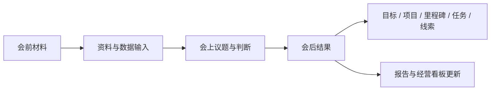

# 34 · 企业工作台正式路线原则与首阶段推进 — 2026-05-25

## 一、本文定位

本文将 `33-企业工作台产品结构与视频交互借鉴讨论整理-2026-05-24.md` 中经 Frank 确认、并经 Claude review 认可的成熟结论，收口为下一阶段执行依据。

本文性质：

1. 是企业工作台扩展方向的正式路线原则文档。
2. 用于指导下一阶段原型设计、数据征集和后续对象建模。
3. 不修改冻结版终局基线 `17-项目原始诉求与终局基线-V1-2026-05-18.md`。
4. 继承 `30-管理工作台与钉钉通道化路线校准-2026-05-24.md` 中“工作台为候选主交互面、钉钉为通知通道”的既有决策。
5. 继承 `32-工作台权限身份与待确认操作路线-2026-05-24.md` 中“身份、权限、审计具备前不开放正式写入”的边界。

文档关系：

| 文档 | 作用 |
|---|---|
| `17` | 冻结版终局基线，不修改 |
| `30` | 钉钉通道化与只读工作台路线决定 |
| `31` | 工作台 V0 试验验收依据 |
| `32` | 身份、权限和写入操作前置约束 |
| `33` | 产品结构、视频借鉴、AI 准入和会议输入的完整讨论记录 |
| `34`（本文） | 已确认正式原则与进入开发的首阶段执行口径 |

## 二、形成依据

### 2.1 已发生的验证

当前试验已经确认：

1. 钉钉复杂任务卡不适合作为管理主界面继续重投入。
2. 网页工作台集中展示任务信息，比钉钉任务卡更适合全局查看和详情判断。
3. 历史测试任务不足以评估真实业务价值。
4. 5 月月会人工 Gold Set 中存在真实经营事实、判断、议题、设想和线索，但 `confirmed + Task` 为 `0` 条。
5. 真实管理信息不能全部强行转成 TDL；工作台需要容纳任务之外的业务对象。

### 2.2 已完成的三方确认

在 `33` 号讨论基础上：

1. Codex 整理并提出六条正式路线原则。
2. Frank 于 2026-05-25 明确确认全部六条原则进入正式路线。
3. Claude 对时间层级、对象边界、中心平台、岗位视角、数据征集、Agent 准入和月度会议输入进行了 review，未提出阻塞项。

## 三、六条正式路线原则

### 原则一：工作台目标扩展为企业管理操作台

正式确认：

> 工作台不再仅被理解为任务列表或任务查看页，而应演进为企业管理操作台，逐步承载行动、数据、议题、资料和报告。

含义：

1. 任务是重要执行对象，但不是全部管理内容。
2. 工作台应支持管理者查看今天要处理的动作，也应支持查看经营事实、待判断议题、风险线索和支撑资料。
3. 工作台未来可承载报告草稿与复盘入口，但任何正式输出都必须有来源和审核边界。

与现有路线的关系：

1. 不推翻 TDL 引擎，TDL 继续作为任务执行能力。
2. 不恢复钉钉任务卡作为主界面，钉钉继续定位为通知触达通道。
3. 当前只读试验页面是管理操作台的验证基础，不是最终完整产品。

### 原则二：管理层级采用日 / 周 / 月 / 季 / 年结构

正式确认以下核心约束：

> 年度目标 / 里程碑 → 季度目标 / 关键项目 → 月度重点 / 部门计划 → 周推进动作 → 今日可执行任务。
>
> 这个层级的价值在于明确区分管理节奏和执行粒度：年度目标是方向，季度目标是阶段成果，月度重点是当期计划，周动作是推进手段，今日任务是可执行单元。

实施约束：

1. 不得将年度目标仅建模为一个截止时间更远的 TDL。
2. 不得将季度关键项目或月度计划未经拆解直接下发为提醒任务。
3. 今日可执行任务可以关联其所属的周动作、月度重点、季度项目和年度目标。
4. 看板应支持从目标向下钻取执行进展，也应支持从具体任务向上追踪其服务的经营目标。

时间层级的初步表达：

| 时间层级 | 主要对象 | 要回答的问题 |
|---|---|---|
| 年度 | 年度目标、关键里程碑、业务线结果 | 全年方向和成果是否达成 |
| 季度 | 阶段目标、关键项目、指标趋势 | 战略推进是否偏航 |
| 月度 | 月度重点、部门计划、复盘结果 | 本月经营安排是否落地 |
| 周度 | 推进动作、协作交付、阻塞 | 本周如何推动结果 |
| 今日 | 可执行任务、临期风险、待处理动作 | 今天必须处理什么 |

### 原则三：业务对象分开管理，并建立明确关联

正式确认：

> 目标、项目、里程碑、任务、议题、想法、线索、资料、指标和报告不能被混为同一种任务记录；后续系统应分别建模，或建立可验证的明确关联。

对象最小职责：

| 对象 | 定义 |
|---|---|
| 目标 | 年度或阶段经营方向及预期结果 |
| 项目 | 为实现目标而组织的一组推进工作 |
| 里程碑 | 项目或目标过程中的阶段验收点 |
| 任务 | 已达到执行准入条件的具体动作 |
| 议题 | 需要进一步讨论、判断或拍板的问题 |
| 想法 / 灵感 | 尚未成熟但值得保存的设想 |
| 观察线索 | 风险、机会、异常或待验证现象 |
| 资料 | 支撑判断的原始文件和证据 |
| 指标数据 | 可进入经营观察和报告的结构化事实 |
| 报告 | 基于已确认事实、状态和人工判断的阶段输出 |

后续 schema 至少需要覆盖以下关系：

| 关系 | 需要表达的内容 |
|---|---|
| 组成关系 | 目标包含项目，项目包含里程碑、月度重点和任务 |
| 影响关系 | 任务或线索影响哪些指标，指标如何支撑目标判断 |
| 证据关系 | 资料、会议记录和数据如何支撑议题、决策、任务或报告 |
| 前置依赖 / 触发关系 | 某个里程碑完成后才能启动另一项目或动作 |

任务准入仍遵守已有严格边界：

> 非客观事实之外，只有满足 `What + Who + When` 的执行事项，才允许进入正式任务准入流程。

### 原则四：正式数据采用中心化受控平台

正式确认：

> 企业正式数据、原始资料、权限、审核和审计，应由中心化受控平台统一管理；个人电脑、网页入口、飞书、钉钉和个人 Agent 均只能作为受控输入或使用入口。

中心平台的目标职责：

| 层面 | 目标职责 |
|---|---|
| 结构化数据 | 保存任务、目标、项目、指标、提交状态、权限关系和报告状态 |
| 原始资料 | 保存上传文件、会议材料、数据原件和证据引用 |
| 身份权限 | 判断谁能提交、查看、审核、操作和导出哪些对象 |
| 审核审计 | 保存提交来源、处理过程、确认人、变更时间和发布记录 |
| API 与页面 | 向老板、部门和岗位工作台提供受控访问 |
| AI 辅助 | 在权限范围内进行解析、分类、校验、检索和草稿生成 |

当前技术理解：

1. 阿里云应作为中心平台的部署与承载方向，不只是文件存储位置。
2. 初期概念验证可以继续基于现有 ECS、FastAPI 和 PostgreSQL 渐进实现。
3. 飞书多维表格可作为某些已固定格式数据的协作或输入渠道，但正式主数据权威策略必须另行设计。
4. 钉钉继续作为现有通知触达和候选身份入口，不恢复为复杂管理主界面。

Agent 接入边界：

1. 采用“中心受控 AI + 本地辅助 Agent”的候选结构。
2. 本地 Agent 可以整理材料、结构化候选内容并发起提交，不能直连数据库或绕过审核改写正式数据。
3. Agent 正式接入必须具备云资源 / API 外层准入和业务权限 / 审核 / 审计内层准入。
4. 首个开发阶段不开放外部 Agent 写入。

### 原则五：专属工作台按岗位职责区分，共享中心数据

正式确认：

> 企业可以为老板和不同岗位设计专属工作台视角，但不为各部门建立相互割裂的独立数据库；各视角共享中心数据，并按权限展示与操作。

首批需要纳入设计研究的视角：

| 工作台视角 | 主要关注内容 |
|---|---|
| 老板 / 总负责人 | 全局目标、各部门进度、重大风险、待拍板事项、报告 |
| 销售 | 招生转化、签约、销售协作、经营风险 |
| 教学 | 教师培训、课程质量、教研标准、课堂能力提升 |
| 教务 | 班主任团队、学员服务、家校沟通、与教学老师的执行协同 |
| 人力 | 招聘、留存、培养、绩效与组织支持 |
| 技术管理 | 数据链路、系统运维、质量与问题排查；不默认拥有业务处理权 |

其中必须坚持：

> 教学与教务属于不同职责视角。教学侧重老师与课程质量；教务侧重班主任团队、学员服务、家校沟通和教学执行协同。

### 原则六：先征集真实数据和职责，再决定首个看板试点

正式确认：

> 不凭空设计数据看板。下一阶段先征集各管理岗位当前实际维护的表格、数据和工作项目，再选择首个数据看板场景与录入方案。

征集内容至少包含：

1. 目前正在填写、维护和提交的表格或数据。
2. 每项数据的目的、填报人、审核人、查看人、维护频率和统计周期。
3. 目前数据口径、文件格式、实际痛点和敏感级别。
4. 各岗位职责范围、阶段工作、例会材料和需要维护的项目清单。
5. 哪些数据适合转换为飞书多维表格，哪些需要先统一口径或保留原件。
6. 哪些录入工作可尝试 AI / 口述辅助，但仍需本人确认和审核。

首个看板试点选择标准：

1. 来源明确且能获得真实样本。
2. 业务负责人能直接判断内容是否正确、有用。
3. 指标数量适中，字段口径可在短期内固定。
4. 权限与敏感风险可控。
5. 能同时验证部门视角和老板视角的差异。

## 四、已确认原则与未批准功能的边界

上述原则确认的是方向和设计约束，不等于以下功能已获准开发上线：

| 暂未批准为正式开发能力 | 原因 |
|---|---|
| 飞书多维表格正式同步 | 需要先完成数据征集和主数据权威策略 |
| 数据文件上传并进入正式看板 | 需要身份、权限、解析、审核、审计和文件存储设计 |
| AI 口述自动录入 | 需要真实材料试跑和人工确认流程 |
| 本地 Agent 正式接入 | 需要认证、scope、凭据管理、审核和审计方案 |
| 跨部门协作流转 | 需要对象关系与权限模型先稳定 |
| 正式任务确认、提醒或状态写入 | 仍受 `32` 号文档写入前置条件约束 |
| 自动报告发布 | 数据权威性和审阅流程未建立 |
| 月度会议自动接入 | 等月度会议结构化方案完成后另行收口 |
| 统一首页的最终 tab、按钮和视觉定稿 | 需要原型试用后判断 |

## 五、与月度会议结构化工作的衔接

Frank 正在并行推进月度会议调整方案，方向包括：

1. 开会节奏与会议结构。
2. 会前预看的准备材料。
3. 会上要讨论的内容。
4. 会后必须达成的结果。

本文仅确认以下衔接原则：

约束：

1. 会后材料不能未经准入判断直接生成任务。
2. 会后明确动作仍必须满足任务准入条件。
3. 会议模板方案形成后，应再次讨论其与工作台对象、数据和报告的接口。

## 六、进入实际开发的首阶段推进

本轮确认后，开发可以继续推进，但应采用低风险、可验证路径。

### 6.1 开发工作线 A：统一首页只读信息架构原型

目标：

> 把已有任务页面和月会判断样本，从两个独立验证页面整理为更接近外部视频操作结构的统一首页原型。

第一版只读原型可以实现：

1. 顶部状态区，表达今日、本周、月度、季度、逾期 / 待判断等候选管理视角。
2. 快捷创建与标准流程区域的视觉位置，用明确“规划中 / 尚未开放”状态避免误解。
3. 一级内容区候选结构：行动与目标、经营数据、议题与线索、资料与报告。
4. 在“行动与目标”中复用已有 TDL 只读内容。
5. 在“议题与线索”中复用已有 5 月月会判断样本。
6. 对尚无真实来源的月度 / 季度 / 年度、经营数据与报告区域，只表达信息架构，不伪造业务数据。

本工作线不做：

1. 正式写入。
2. 假数据冒充真实经营数据。
3. 真实权限系统。
4. 飞书或 Agent 接入。

验收问题：

1. Frank 与 Helen 是否认为统一首页更接近真实日常操作台。
2. 日 / 周 / 月 / 季 / 年层级应如何在界面中呈现而不造成过载。
3. 哪些创建入口和流程入口值得进入后续真实能力设计。

### 6.2 业务工作线 B：管理岗位数据与职责征集

目标：

> 获得选择首个数据看板试点所需的真实输入，不先凭假设建数据模型。

第一批征集范围候选：

1. 销售。
2. 教学。
3. 教务。
4. 人力。
5. 技术管理。

产出：

1. 管理岗位数据与职责征集模板。
2. 各岗位现有表格、数据口径、维护方式和敏感性清单。
3. 可转飞书多维表格候选清单。
4. 首个经营看板试点建议。

### 6.3 暂不进入的开发工作

在 A 与 B 没有形成真实反馈之前，暂不进入：

1. 正式上传与解析链路开发。
2. 统一目标 / 项目 / 指标数据库迁移。
3. AI 或本地 Agent 写入 API。
4. 跨部门操作流。
5. 报告自动生成或发布。

## 七、下一步 PR 顺序

在本文经 Claude review 并由 Frank 确认合入后，建议执行顺序如下：

| 顺序 | PR 目标 | 类型 | 主要边界 |
|---:|---|---|---|
| 1 | 企业工作台正式路线原则与首阶段推进（本文） | 文档 | 固化方向，不开发能力 |
| 2 | 统一首页只读信息架构原型 | 代码 / UI | 只读、复用现有数据、不伪造数据 |
| 3 | 管理岗位数据与职责征集模板 | 文档 / 表单设计 | 不建正式数据接口 |
| 4 | 根据反馈形成对象关系和首个看板试点方案 | 设计 | 不直接写生产数据 |

## 八、当前结论

正式路线结论是：

> 管理工作台从任务查看入口继续演进为企业管理操作台；以日、周、月、季、年的管理层级组织目标与执行，以中心化受控平台承载正式数据和权限审计，以岗位专属视角服务真实协作。下一阶段先推进统一首页只读原型与岗位数据征集，不提前打开正式数据写入、Agent 接入或自动经营结论发布能力。
