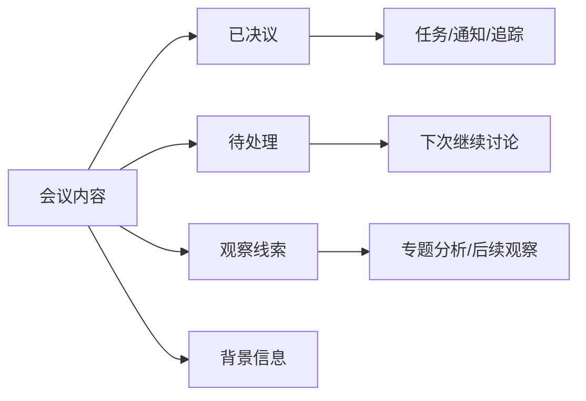

# 励步 5 月月度会会议录入非生产真实链路试跑方案 — 2026-05-18

## 1. 试跑目的

上一轮只完成了“人工基准 + 非生产参考抽取”，还没有验证当前正式代码链路能不能把真实会议材料稳定变成高质量 TDL 草稿。

本轮试跑要回答 5 个问题：

1. 生产解析器在真实材料上能不能跑通。
2. 系统能不能先理解 7 份材料共同指向的经营主题、关键矛盾、协同关系和节奏，而不是只机械摘取任务句子。
3. “按来源文件理解 → 抽取 → 合并去重 → 二次校验”是否优于整包一次性抽取。
4. 输出候选和 29 条人工基准相比，召回、误提、负责人、截止时间、完成标准分别到什么水平。
5. 哪些候选已经可以进入下一步钉钉小范围交互，哪些仍只能留在评测报告中。

## 1.1 月会输出不只包含任务

月度会正式产物至少应分成 4 类，不能把所有内容都硬压成 TDL：

| 类别 | 定义 | 后续动作 |
|---|---|---|
| `已决议` | 会上已经完成判断，形成明确结论：结束、继续、推进、调整、处理、归责等 | 可进一步拆成任务、同步结论、纳入后续追踪 |
| `待处理` | 已经被拿到会上讨论，但没有谈透、没有形成共识、没有落成完整方案 | 保留议题，进入待继续讨论池，不直接伪装成已定任务 |
| `观察线索` | 通过会议暴露出值得注意的现象、矛盾、机会或风险，但会上只是浅尝辄止 | 进入观察池，后续可转成专题分析或新一轮议题 |
| `背景信息` | 为理解上下文所需，但本身不是结论、议题或动作 | 只保留为证据，不进入行动池 |

这 4 类的关系是：

## 2. 明确边界

本轮是**非生产真实链路试跑**：

- 使用真实材料。
- 使用正式代码和正式提示词链路。
- 可以调用真实模型。
- 但不写正式 `tdls` 表，不向任何管理者推送，不创建正式日历事件。

也就是说，本轮验证“会不会正确生成”，不验证“是否已经适合直接给全员使用”。

## 3. 输入材料与基准

输入材料沿用：

1. `2026.5.9会议_原文.docx`
2. `运营经理（市场+销售）时颖26年5月述职.docx`
3. `HR张浩4月述职(1).xlsx`
4. `4月述职-教务经理赵晓华.xlsx`
5. `教学主管曹艳明.xlsx`
6. `教学主管邢杨.xlsx`
7. `新师培训师韩雪敏述职(1).xlsx`

人工 gold set：

- `00-人工提炼基准任务清单-2026-05-17.md`

历史对照：

- `01-会议录入DeepSeek参考评测-2026-05-17.md`

## 4. 试跑路线

### 路线 A：现状基线

把 7 份材料合并后一次性送入当前会议解析器。

用途：

- 作为“当前系统默认能力”的基线。
- 便于和 5 月 17 日 DeepSeek 参考版做横向比较。

### 路线 B：建议方案

按来源文件先做业务理解，再做候选任务抽取，最后统一合并去重和二次校验。

执行顺序：

1. 逐份形成业务理解摘要：
   - 这份材料主要在解决什么经营问题
   - 涉及哪些角色、目标、风险和依赖
   - 哪些事项是阶段目标，哪些是执行动作，哪些只是背景判断
2. 先汇总 7 份材料的共通经营主题，形成“本月经营脉络”。
3. 再逐份对会议内容做分类：`已决议 / 待处理 / 观察线索 / 背景信息`。
4. 只从 `已决议` 和部分已明确可执行的 `待处理` 中抽取候选任务。
5. 每条候选保留 `source_file`、`source_excerpt`、`meeting_classification`、`business_theme`、`goal_link`、`owner`、`due_at`、`completion_criteria`。
6. 把 7 份候选汇总。
7. 做跨文件去重：
   - 标题近似
   - 负责人相同
   - 交付物相同
   - 时间窗口相近
8. 做二次校验：
   - 是否真的是动作，而不是观点或背景。
   - `due_at` 是否来自原文明确日期。
   - `owner` 是否能映射到 roster。
   - `completion_criteria` 是否原文有据。
   - 是否能挂回某个明确的业务主题、阶段目标或经营矛盾。
   - 是否把 `待处理` 或 `观察线索` 误写成了“已经拍板”的任务。

## 5. 输出文件

本轮至少产出 8 份文件：

1. `03-会议录入业务理解摘要-YYYY-MM-DD.md`
2. `04-会议录入内容分类表-YYYY-MM-DD.md`
3. `05-会议录入候选任务-整包基线-YYYY-MM-DD.md`
4. `06-会议录入候选任务-逐文件抽取-YYYY-MM-DD.md`
5. `07-会议录入去重后候选任务-YYYY-MM-DD.md`
6. `08-会议录入人工对照评测表-YYYY-MM-DD.md`
7. `09-会议录入任务依赖与节奏图-YYYY-MM-DD.md`
8. `10-会议录入试跑结论-YYYY-MM-DD.md`

如果真实模型调用仍然失败，额外记录：

9. `11-会议录入模型链路阻塞记录-YYYY-MM-DD.md`

## 6. 评测维度

| 维度 | 记录方式 |
|---|---|
| 召回 | `hit / missed` |
| 误提 | `false_positive / acceptable_context` |
| 负责人 | `exact / partial / wrong / missing` |
| 截止时间 | `exact / coarse / hallucinated / missing` |
| 完成标准 | `preserved / weakened / invented / missing` |
| 去重 | `unique / duplicate / merged` |
| 来源可追溯 | `yes / no` |
| 主题归属 | `exact / weak / missing` |
| 依赖关系 | `upstream / downstream / parallel / none` |
| 会议分类 | `decided / pending / signal / background` |

## 7. 通过门槛

### 7.1 进入下一轮小范围钉钉交互试点

必须同时满足：

1. 召回率 `>= 50%`
2. 误提率 `<= 15%`
3. 截止时间编造数 `= 0`
4. 完成标准编造数 `= 0`
5. 候选任务均可追溯回来源文件或片段

### 7.2 进入更正式的会议录入能力开发

建议目标：

1. 召回率 `>= 70%`
2. 负责人正确率 `>= 80%`
3. 明确截止时间保留率 `>= 80%`
4. 去重后重复项 `<= 5%`

这里故意把“进入真实试点”的门槛设得低于“认为能力成熟”的门槛。原因是会议录入不能长期卡在离线评测，`50% 召回 + 0 编造` 已经足够开始小范围真测。

## 8. 操作步骤

### 第一步：准备输入与业务理解

1. 把 7 份原始材料转成保留结构的纯文本。
2. 每份文件单独保存，不能先人工合并改写。
3. 表格材料要保留 sheet、字段名和层级关系。
4. 会议原文要保留段落顺序或时间戳。
5. 对每份材料先形成业务理解摘要，至少回答：
   - 本文件主要在谈什么业务议题
   - 它与公司当前阶段目标的关系
   - 涉及哪些核心角色
   - 暗含哪些前后依赖
   - 哪些内容是任务，哪些只是目标、判断、风险或复盘
6. 汇总 7 份摘要，先形成一版“本月经营主题图”，再进入任务抽取。
7. 对会议原文与关键讨论片段同步做内容分类，先分清 `已决议 / 待处理 / 观察线索 / 背景信息`。

### 第二步：先跑整包基线

1. 调用当前正式会议解析链路。
2. 只把结果落成候选任务文件。
3. 不写生产库，不发卡片，不建日历。

### 第三步：再跑逐文件抽取

1. 对 7 份材料逐一解析。
2. 每条候选都必须挂接到对应 `business_theme` 或 `goal_link`。
3. 每条候选都必须声明自己来自 `已决议` 还是 `待处理`。
4. 比较每份文件命中的任务分布。
5. 观察是否比整包抽取更能保留细颗粒度任务。

### 第四步：合并去重

1. 聚合 7 份候选。
2. 先按语义相似和交付物合并，再人工复核。
3. 保留每条任务的来源集合，不能为了去重丢掉证据链。

### 第五步：人工评测

1. 对照 29 条基准逐项标注。
2. 单独统计：
   - 漏掉的基准项
   - 多提的误项
   - 负责人偏差
   - 被编造的日期
   - 被弱化或发明的完成标准
   - 无法挂回经营主题的孤立任务
   - 被误判为“已决议”的待处理议题或观察线索
3. 补画任务依赖与节奏图：
   - 哪些任务是前置动作
   - 哪些任务支撑同一经营主题
   - 哪些任务之间存在跨部门协同
4. 比较路线 A 与路线 B。

### 第六步：给出结论

结论只允许落在以下 3 类之一：

1. `可进入小范围交互试点`
2. `继续离线优化一轮`
3. `链路被阻塞，先修基础设施`

不得用“整体还不错”“再看看”这种不可执行表述代替结论。

## 9. 与四项后续开发建议的衔接

本试跑结束后，后续开发按以下顺序推进：

1. 把“业务理解 → 逐文件抽取 → 合并去重 → 二次校验”做成正式会议录入流水线。
2. 把按钮交互作为日常助手的主验证线，补齐真实钉钉端到端验收。
3. 做一次同一任务的三种呈现 A/B/C 对照：
   - 钉钉日历
   - 钉钉原生待办
   - 独立提醒消息
4. 继续把高频判断规则沉淀进显式规则文件，减少 AI 只靠通用推理。

## 10. 本轮结束后的判断口径

如果路线 B 明显优于路线 A，后续不再继续优化“整包一次性抽取”，直接把“逐文件业务理解 + 任务流水线”视为正式路线。

如果模型链路仍然因 OpenAI 连通性失败，本轮结论不是“会议录入效果差”，而是“当前基础设施还没达到试点评测前提”，优先回到网络与模型链路修复。
